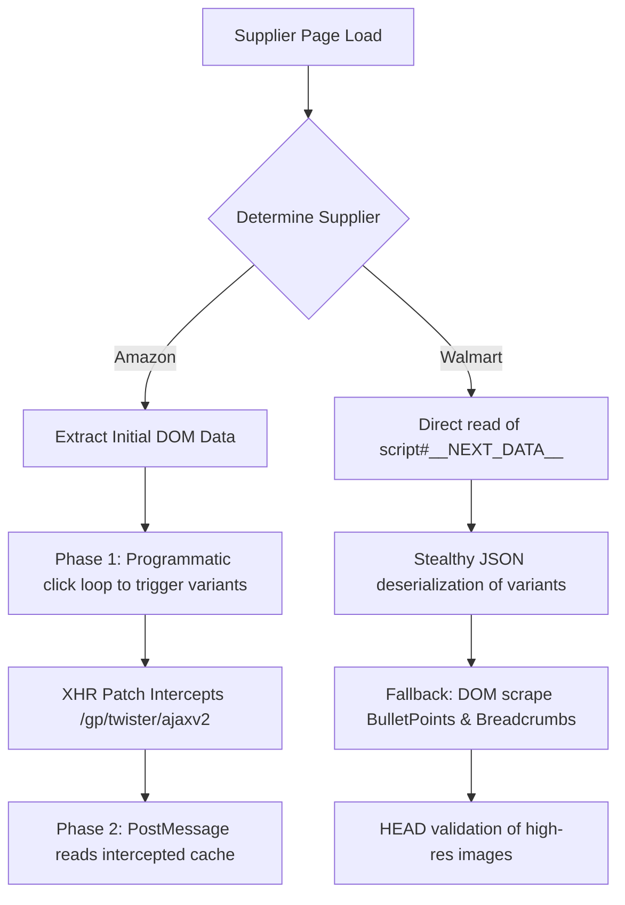

# SellerSuit Security, Scraping & eBay-Policy Audit Report

This report presents a detailed read-only security, scraping, and policy compliance audit of the SellerSuit browser extension and SaaS platform.

---

## A. Executive Summary

### Plain English Summary
SellerSuit is a tools platform designed to let eBay sellers import product data from Amazon and Walmart. However, a deep review of the codebase reveals that the system does not use official channels to list products on eBay. Instead, it directly intercepts the seller's active login cookies to interact with eBay's private, internal web interface. It also clicks variation selectors on Amazon pages at speeds no human could achieve. 

Because it mimics human actions programmatically and bypasses official APIs, eBay and Amazon’s security systems (such as Akamai Bot Manager) can easily detect and flag these sessions. This poses a **Critical Risk** of permanent eBay account suspension for dropshipping violations, trademark/image copyright strikes, and automated bot actions. Additionally, the extension's code contains security flaws—like weak messaging validation—that could let a hacker steal the user's SaaS account tokens if the main website is compromised. Finally, a database-level flaw allows users to modify their own Stripe customer IDs client-side, enabling free access to paid plans.

### Technical Summary
SellerSuit is built as a Vite-React single-page application (SPA) and a Manifest V3 Chrome extension. Product scraping employs client-side DOM-swatch click simulation (50ms–250ms intervals) coupled with XHR response interception (`amazon-xhrpatch.js`) on Amazon, and memory-dehydrated state deserialization (`__NEXT_DATA__`) on Walmart. 

Listing automation bypasses the official eBay Sell REST APIs. Instead, it utilizes the seller's active browser cookies (`credentials: 'include'`) to perform HTTP `PUT` and `POST` calls directly to eBay's private frontend draft endpoints (`/lstng/api/listing_draft` and `/msku-update`). Standard and bulk uploads require manual publishing, serving as a partial human-in-the-loop gate. 

A critical Postgres RLS bypass exists in the `profiles` table update policy where `stripe_customer_id` is left unguarded, allowing users to hijack subscription statuses. Furthermore, cross-window messaging (`bridge.js`) fails to validate `event.origin`, creating XSS-based token exfiltration and background privilege escalation pathways.

### Quick Verdict Table
| Check | Status | Details |
| :--- | :---: | :--- |
| **eBay Official API Used?** | **NO** | Bypasses official REST APIs; interacts directly with private endpoints. |
| **eBay Private/Unofficial API Used?** | **YES** | Intercepts session credentials to call frontend draft endpoints. |
| **Supplier API Used?** | **NO** | Relies on DOM scraping, Next.js state extraction, and XHR patching. |
| **Account Harm / Suspension Possible?** | **YES** | Highly vulnerable to Akamai bot flags, VeRO copyright strikes, and dropshipping violations. |

---

## B. Complete Network/API Inventory

The following table documents all network and API call surfaces identified across the client-side Chrome extension, Vite dashboard, and backend Supabase Edge Functions:

| File:Line | Function/Module | Endpoint/Domain | Method | Purpose | Data Sent | Data Received | Type | Auth/Cookie/Token used? | User data exposed? | Risk | Why | Recommendation |
| :--- | :--- | :--- | :---: | :--- | :--- | :--- | :--- | :---: | :---: | :---: | :--- | :--- |
| [ebay-listing-api.js:133](file:///d:/eBay%20Software/2026sellersuit/sb1/apps/extension/common/ebay-listing-api.js#L133) | `getCategorySuggestions` | `ebay.com/lstng/api/category_suggestions` | `GET` | Fetch leaf category recommendations | Title string query | Suggestions array | Internal-Private | Yes (Cookies) | No | **Low** | Read-only category suggestions lookup. | Migrate to official eBay Taxonomy API. |
| [ebay-listing-api.js:161](file:///d:/eBay%20Software/2026sellersuit/sb1/apps/extension/common/ebay-listing-api.js#L161) | `createDraft` | `ebay.com/sl/list` | `GET` | Extract inline draft configs/tokens | URL query params | HTML + CSRF tokens | Internal-Private | Yes (Cookies) | No | **High** | Reads private pages to extract CSRF keys. | Migrate to official eBay Sell API. |
| [ebay-listing-api.js:212](file:///d:/eBay%20Software/2026sellersuit/sb1/apps/extension/common/ebay-listing-api.js#L212) | `saveDraft` | `ebay.com/lstng/api/listing_draft/${draftId}` | `PUT` | Save standard single-item draft | JSON payload | JSON status | Internal-Private | Yes (Cookies) | Yes (Product Info) | **Critical** | Directly updates eBay seller drafts; easily flagged by Akamai. | Migrate to official eBay Sell API. |
| [ebay-listing-api.js:738](file:///d:/eBay%20Software/2026sellersuit/sb1/apps/extension/common/ebay-listing-api.js#L738) | `saveVariations` | `bulkedit.ebay.com/msku-update` | `POST` | Save multi-variation configurations | JSON payload | JSON status | Internal-Private | Yes (Cookies) | Yes (Variants) | **Critical** | Writes variation metrics directly to internal bulk edit tool. | Migrate to official eBay Sell API. |
| [ebay-photo-uploader.js:57](file:///d:/eBay%20Software/2026sellersuit/sb1/apps/extension/common/ebay-photo-uploader.js#L57) | `uploadImage` | `msa-b1.ebay.com/ws/eBayISAPI.dll?EpsBasic` | `POST` | Upload product images to eBay | Multipart/Form-data | Plaintext Token | Internal-Private | Yes (Cookies) | No | **High** | Direct image upload to internal EPS endpoints. | Migrate to official eBay EPS API. |
| [alarm-handler.js:23](file:///d:/eBay%20Software/2026sellersuit/sb1/apps/extension/background/alarm-handler.js#L23) | `syncSettings` | `supabase.co/rest/v1/admin_settings` | `GET` | Retrieve global settings/API keys | None | Settings payload | Backend-Private DB | Yes (saasToken) | Yes (API Keys) | **Medium** | Exposes administrative keys (e.g. Gemini key) to the browser. | Move key logic to secure Edge Functions. |
| [message-router.js:103](file:///d:/eBay%20Software/2026sellersuit/sb1/apps/extension/background/message-router.js#L103) | `startPairing` | `supabase.co/functions/v1/extension-pairing-start` | `POST` | Initiate pairing session | Device name | Session identifier | Backend-Private API | None (Anon key) | No | **Low** | Standard device registration. | None. |
| [auth-helper.js:478](file:///d:/eBay%20Software/2026sellersuit/sb1/apps/extension/common/auth-helper.js#L478) | `checkAuthStatus` | `supabase.co/functions/v1/auth-status` | `POST` | Validate JWT authentication | JWT token header | Profile details | Backend-Private API | Yes (JWT Token) | Yes (Profile) | **Low** | Validates session status. | None. |
| [generate-titles/index.ts:138](file:///d:/eBay%20Software/2026sellersuit/sb1/supabase/functions/generate-titles/index.ts#L138) | DB Query | Supabase Database | DB Read | Fetch AI keys securely on backend | None | AI API keys | Backend-Service | Yes (Service Role) | No | **Low** | Secure database query. | None. |
| [bridge.js:192](file:///d:/eBay%20Software/2026sellersuit/sb1/apps/extension/content_scripts/bridge.js#L192) | Window Message Handler | Local Window Listener | Event | Receive data from dashboard | event.data | None | DOM action | None | Yes (JWT Tokens) | **High** | No origin check; vulnerable to cross-origin token theft. | Add strict `event.origin` verification. |

---

## C. Scraping Flow Analysis

SellerSuit extracts product details from Amazon and Walmart using browser-injected content scripts. The data-gathering paths operate as follows:



### 1. Amazon Scraping Flow
*   **Methodology**: Hybrid. Static elements (title, description, specifications) are scraped directly from the DOM. However, variation details (prices, stock, images) are dynamically updated on the page. The scrapers (`amazon-variant-scraper.js` and `amazon-scraper-v2.js`) programmatically invoke `.click()` on variation selectors at rapid intervals (50ms–250ms).
*   **Interception**: The companion script [amazon-xhrpatch.js](file:///d:/eBay%20Software/2026sellersuit/sb1/apps/extension/content_scripts/amazon-xhrpatch.js) is injected into the window's `MAIN` world. It overrides `XMLHttpRequest.prototype.open`, catches network traffic heading to `/gp/twister/ajaxv2`, and caches the returned JSON buybox details. The content script retrieves this cache via `window.postMessage`.
*   **Collected Fields**: ASIN, parent ASIN, title, brand, price, currency, availability, description, bullet points, specifications tables, full variation combinations, and high-resolution images.
*   **Bypasses & Mitigations**: The code runs in the user's active browser, naturally adopting their browser fingerprint and cookies. The scraper features a CAPTCHA check (`_captchaGuard`); if Amazon triggers a CAPTCHA challenge, the script halts to prevent triggering permanent IP bans.

### 2. Walmart Scraping Flow
*   **Methodology**: Stealthy/Data-First. The scraper [walmart-variant-scraper.js](file:///d:/eBay%20Software/2026sellersuit/sb1/apps/extension/content_scripts/walmart-variant-scraper.js) extracts the pre-loaded JSON block from `<script id="__NEXT_DATA__">` in a single pass. This parses the full product variant matrix, prices, and availability without needing simulated clicks.
*   **Fallback**: If NextJS state is missing, `walmart_injector.js` falls back to DOM selectors for highlights, bullet points, and reviews.
*   **Image Validation**: High-resolution supplier images are generated by stripping size URL queries (e.g. `_100.` -> `_1200.`), and the script executes back-to-back `HEAD` requests to verify image availability and ensure file sizes exceed 50KB. It limits these active HEAD validation calls to 20 unique images to avoid rate-limiting triggers.

---

## D. eBay Upload/Listing Flow Analysis

The upload flow maps the scraped product payload to eBay draft templates and submits them using private cookies:

1.  **Draft Initialization**: The script performs a `GET` request to `https://www.ebay.com/sl/list` to retrieve key parameters, including `draftId`, CSRF tokens (`_csrf`), and EPS configuration keys.
2.  **Image Transmissions**: Original images are fetched as binary Blobs via cross-origin service worker messages (bypassing CSP restrictions), resized to a standard $1600 \times 1600$ canvas, watermarked, and POSTed to eBay's photo servers at `https://msa-b1.ebay.com/ws/eBayISAPI.dll?EpsBasic`.
3.  **Draft Population**: Staged product details (title, AI descriptions, MPN/attributes, pricing) are updated via `PUT` calls to `https://www.ebay.com/lstng/api/listing_draft/${draftId}?mode=AddItem`.
4.  **Variation Integration**: For multi-variation listings, the variation matrix, unique SKUs (generated via `SSSkuEngine`), and variant image arrays are POSTed to `https://bulkedit.ebay.com/msku-update`.
5.  **Human Gate**:
    *   **Single-item listing**: Once background staging is complete, the extension redirects the active tab to `https://www.ebay.com/lstng?draftId=${draftId}&mode=AddItem`, placing the user in the standard eBay listing editor. The user must manually click "List it".
    *   **Bulk listing queue**: The background runner `listing-runner.js` opens temporary tabs to stage drafts programmatically, closing them upon completion. Listings are **left as saved drafts** on eBay; the user must log into Seller Hub to review and publish them.

---

## E. eBay Policy Violation & Suspension Risk

| Risk Element | Technical Code Exposure | Policy Impact | Risk Level | Policy Reference / Source Date |
| :--- | :--- | :--- | :---: | :--- |
| **Dropshipping / Retail Arbitrage** | Uses adapters to import directly from retail sites:<br>• [amazon/adapter.js](file:///d:/eBay%20Software/2026sellersuit/sb1/apps/extension/suppliers/amazon/adapter.js)<br>• [walmart/adapter.js](file:///d:/eBay%20Software/2026sellersuit/sb1/apps/extension/suppliers/walmart/adapter.js) | Strictly violates dropshipping policies prohibiting purchasing items from other retailers. Highly vulnerable when tracking numbers from Amazon/Walmart are uploaded or buyers report retail boxes. | **Critical** | eBay Dropshipping Policy (June 2026) |
| **Private API Abuse** | Mimics internal React endpoints using active cookies:<br>• `ebay.com/lstng/api/listing_draft`<br>• `bulkedit.ebay.com/msku-update` | Violates user agreements prohibiting unauthorized scraper and bot activity. Easily flagged by Akamai Bot Manager, endangering the seller's active session. | **Critical** | eBay User Agreement Section 9 (Updated 2026) |
| **Copyright Infringement** | Copies images and description text from source sites:<br>• [ebay_prelist.js:14-63](file:///d:/eBay%20Software/2026sellersuit/sb1/apps/extension/content_scripts/ebay_prelist.js#L14) | Violates copyright policies. Triggers immediate Verified Rights Owner (VeRO) takedown strikes, resulting in listing removals or account suspension. | **High** | eBay Images, Videos, and Text Policy (June 2026) |
| **Price & Stock Desync** | Lacks background price tracking or stock reconciliation routines in the worker code. | Leads to cancelling out-of-stock orders or shipping items late, accumulating seller defect points. | **High** | eBay Selling Practices Policy (June 2026) |

---

## F. Human-like vs Bot-like Behavior

The extension is categorized as **Bot-like / High-risk automation** due to several factors:

*   **Amazon Swatch Clicking**: Simulating clicks at 50ms intervals on swatch nodes lacks natural cursor paths, hover telemetry, or mouse scroll behaviors. This programmatic signature is easily flagged by anti-bot telemetry, leading to CAPTCHAs or IP blocks.
*   **Background Fetch Sequences**: Issuing direct `PUT` and `POST` calls to private endpoints without preceding user activity or proper telemetry headers (e.g. tracking scripts) triggers server-side bot anomalies.
*   **Image HEAD Requests**: Making up to 20 back-to-back HEAD requests to Walmart servers presents a programmatic signature.
*   **Walmart Scraping (Stealthy)**: The Walmart `__NEXT_DATA__` reader is entirely passive and compliant with stealth guidelines as it executes no dynamic interactions or auxiliary traffic.

---

## G. Extension Permission & Security Risk

### 1. Permissions Audit
*   **Broad host_permissions**: By requesting access to broad wildcard domains (`*://amazon.com/*`, `*://*.walmart.com/*`), the extension bypasses the browser's Same-Origin Policy (SOP). If the extension is compromised, these permissions allow scripts to read cookies and intercept credentials on those origins.
*   **Unused Permissions**: The host permission `*://*.alicdn.com/*` is requested in `manifest.json` but never referenced in the codebase, violating the Chrome Web Store's **Least Privilege Principle** and risking immediate store rejection.

### 2. Message Passing and RCE Vulnerabilities
*   **Missing Origin Checking**: In `bridge.js`, the extension listens for messages from the page without validating `event.origin`:
    ```javascript
    // apps/extension/content_scripts/bridge.js:192-194
    window.addEventListener('message', (event) => {
        if (event.source !== window) return;
    ```
    If `sellersuit.com` is compromised via Cross-Site Scripting (XSS), any script can post messages to the extension, triggering background commands, retrieving stored user JWT tokens, or launching bulk listing tasks.
*   **Unvalidated Tab Openings**: The background message router opens arbitrary URLs:
    ```javascript
    // apps/extension/background/message-router.js:286-288
    if (request.action === 'OPEN_BACKGROUND_TAB') {
      chrome.tabs.create({ url: request.url, active: false });
    ```
    A compromised dashboard can use this to force the extension to open background tabs to download malicious files or exploit local router vulnerabilities.
*   **Unvalidated Script Execution Target**: The action `openNewTabForDescription` opens a caller-supplied `request.targetURL` and automatically injects `description_paster.js`. If the URL is not restricted, scripts can be run on arbitrary web domains.

---

## H. Data Privacy & Account Safety

*   **Token Exposure**: Authentication tokens (`saasToken`, `saasRefreshToken`) are transferred from the web app's `localStorage` to the extension context via unvalidated window messaging. If the dashboard is vulnerable to XSS, these tokens can be stolen.
*   **Admin API Key Leak**: The global settings synchronization logs the admin's `geminiApiKey` in plaintext to the extension's console log:
    ```javascript
    // apps/extension/background/alarm-handler.js:77
    console.log('🔄 SYNC: Settings updated from Admin Panel.', updates);
    ```
*   **Database RLS Bypass (Subscription Hijacking)**: In the profile update billing guard trigger:
    ```sql
    -- supabase/migrations/20260616010000_auth_billing_security_hardening.sql:79-85
    IF NEW.credits             IS DISTINCT FROM OLD.credits
       OR NEW.payment_status      IS DISTINCT FROM OLD.payment_status
       OR NEW.customer_id         IS DISTINCT FROM OLD.customer_id
    ```
    The column `stripe_customer_id` is **not guarded**. Because the `profiles` table UPDATE RLS policy allows owners to write to their own row, any user can update their own `stripe_customer_id` client-side. The user can then trigger `/check-subscription-v2`, which reconciles the billing state using the service-role client, upgrading the user's plan and credits to match the hijacked Stripe customer.

---

## I. Harmful / Unsafe Behavior List

We have identified and ranked the most critical vulnerabilities and unsafe practices in the codebase:

1.  **Profiles RLS Bypass**
    *   *Path*: `supabase/migrations/20260616010000_auth_billing_security_hardening.sql:79-94`
    *   *Risk*: **Critical**. Allows any user to hijack active Stripe customer profiles and obtain free credits/subscriptions.
2.  **Private eBay Endpoint Staging**
    *   *Path*: `apps/extension/common/ebay-listing-api.js:212` and `738`
    *   *Risk*: **Critical**. Interacting with private endpoints via browser-intercepted cookies runs high risk of trigger-happy bot-telemetry blocks by Akamai.
3.  **Missing Origin Verification in bridge.js**
    *   *Path*: `apps/extension/content_scripts/bridge.js:192-220`
    *   *Risk*: **High**. Exposes SaaS auth tokens and extension triggers to website XSS attacks.
4.  **Plaintext API Key Console Logging**
    *   *Path*: `apps/extension/background/alarm-handler.js:77`
    *   *Risk*: **High**. Exposes the Gemini API key in extension logs.
5.  **Rapid Programmatic Swatch Clicking**
    *   *Path*: `apps/extension/content_scripts/amazon-variant-scraper.js:350-401`
    *   *Risk*: **Medium**. Simulates clicks at $50\text{ms}$ intervals, triggering Amazon CAPTCHAs.

---

## J. Safe Behavior List

The following elements of the codebase are safe, compliant, and represent solid engineering decisions:

1.  **Walmart NextJS State Deserialization**: Resolving variants from `__NEXT_DATA__` is passive, rapid, and does not trigger anti-bot telemetry.
2.  **Token Signature Validation Safeguard**: The extension does not trust tokens blindly; it validates them against the Supabase `/auth-status` endpoint before enabling dashboard features.
3.  **EPS Image Upload Concurrency Cap**: Uploading images in groups of 3 reduces concurrency overhead.
4.  **Duplicate Check Helper**: Verifies source IDs against `user_listings` before staging uploads, preventing duplicate listing issues.

---

## K. Risk Matrix

| Finding | Critical | High | Medium | Low | Safe |
| :--- | :---: | :---: | :---: | :---: | :---: |
| **Postgres Profiles RLS Bypass** | **X** | | | | |
| **Private eBay Endpoints Staging** | **X** | | | | |
| **Retail Dropshipping Workflow** | **X** | | | | |
| **Missing event.origin verification** | | **X** | | | |
| **Plaintext Gemini Key Logging** | | **X** | | | |
| **VeRO Image Copyright Exposure** | | **X** | | | |
| **Amazon 50ms Swatch Clicking** | | | **X** | | |
| **Unused alicdn.com Permission** | | | **X** | | |
| **Duplicate Listing Checker** | | | | **X** | |
| **Walmart State Deserialization** | | | | | **X** |

---

## L. Exact Evidence Appendix

### 1. Profiles RLS Bypass
```sql
-- supabase/migrations/20260616010000_auth_billing_security_hardening.sql:79-85
IF NEW.credits             IS DISTINCT FROM OLD.credits
   OR NEW.payment_status      IS DISTINCT FROM OLD.payment_status
   OR NEW.subscription_status IS DISTINCT FROM OLD.subscription_status
   OR NEW.plan_id             IS DISTINCT FROM OLD.plan_id
   OR NEW.selected_plan_id    IS DISTINCT FROM OLD.selected_plan_id
   OR NEW.pending_plan_id     IS DISTINCT FROM OLD.pending_plan_id
   OR NEW.customer_id         IS DISTINCT FROM OLD.customer_id
```
*   *Explanation*: The list of columns blocked from user updates fails to include `stripe_customer_id`, allowing client-side updates to bypass subscription limits.

### 2. Missing Origin check in bridge.js
```javascript
-- apps/extension/content_scripts/bridge.js:192-195
window.addEventListener('message', (event) => {
    if (event.source !== window) return;

    const data = event.data;
```
*   *Explanation*: Without validating `event.origin`, any third-party script or XSS on the dashboard can post messages and extract the stored JWT tokens.

### 3. Private eBay Staging Endpoints
```javascript
-- apps/extension/common/ebay-listing-api.js:212-215
const resp = await fetch(
  `https://www.ebay.${suffix}/lstng/api/listing_draft/${draftId}?mode=AddItem`,
  {
    method: 'PUT',
```
*   *Explanation*: Staging listing changes directly to private drafts endpoints bypasses official eBay APIs and is highly vulnerable to bot-detection systems.

### 4. Admin API Key Console Logging
```javascript
-- apps/extension/background/alarm-handler.js:75-77
if (Object.keys(updates).length > 0) {
  await chrome.storage.local.set(updates);
  console.log('🔄 SYNC: Settings updated from Admin Panel.', updates);
```
*   *Explanation*: Logs the updated settings payload (which contains `geminiApiKey` in plaintext) to the extension's console logs.

### 5. Amazon 50ms Swatch Clicking
```javascript
-- apps/extension/content_scripts/amazon-variant-scraper.js:350-353
    for (const asin in t.asinToDimensionIndexMap) {
      const dimIndices = t.asinToDimensionIndexMap[asin];  // e.g. [0, 1]

      for (let h = 0; h < dimIndices.length; h++) {
```
*   *Explanation*: Rapid, programmatic clicking loops without cursor telemetry simulate bot behavior and trigger CAPTCHAs.

---

## M. Recommendations

### 1. Must-Fix Before Production
*   **Secure RLS Trigger**: Modify the Postgres trigger function `guard_profile_billing_columns()` to block updates to `stripe_customer_id`:
    ```sql
    IF NEW.credits             IS DISTINCT FROM OLD.credits
       OR NEW.payment_status      IS DISTINCT FROM OLD.payment_status
       OR NEW.stripe_customer_id  IS DISTINCT FROM OLD.stripe_customer_id -- Block updates
    ```
*   **Enforce Origin check**: Add origin verification to `bridge.js`:
    ```javascript
    if (event.origin !== window.location.origin) return;
    ```
*   **Sanitize logs**: Strip the `geminiApiKey` property from logs in `alarm-handler.js` before calling `console.log`.
*   **Sanitize Manifest**: Remove the unused `*://*.alicdn.com/*` domain from `manifest.json`.
*   **Secure tab opening**: Add URL validation to the `OPEN_BACKGROUND_TAB` handler to allow only trusted targets.

### 2. Should-Fix Soon
*   **Migrate to Official eBay APIs**: Transition the draft creation process to the official eBay Sell API to eliminate Akamai bot risks.
*   **Implement Inventory Sync**: Establish a background worker to reconcile inventory and prices, reducing out-of-stock cancellations.

### 3. Nice-to-Improve
*   **Integrate Image Alteration**: Add an AI image variation generator to alter scraped images, protecting sellers from VeRO copyright claims.

### 4. Safe Operating Rules for End Users
*   Limit bulk lister operations to small batches to avoid listing velocity alerts.
*   Avoid dropshipping from retail Amazon/Walmart links directly. Encourage wholesaling configurations.

---

## N. Final Verdict

1.  **Uses eBay official API?** No.
2.  **Uses eBay private/unofficial API?** Yes.
3.  **Uses supplier official/internal/unofficial API?** No (scrapes DOM and JSON blocks).
4.  **Scrapes by DOM or by API?** DOM and Next.js JSON blocks (Walmart).
5.  **Uploads via official API or browser automation?** Browser automation targeting private API endpoints.
6.  **Can it harm an eBay account?** Yes.
7.  **Can it cause suspension?** Yes, due to retail dropshipping violations, private API abuse, and scraped image copyright strikes.
8.  **Safe for production?** No.
9.  **Exact changes required to make it safer**:
    *   Fix the profiles RLS billing guard.
    *   Add origin check to the bridge listener.
    *   Remove unused `alicdn.com` manifest permission.
    *   Sanitize extension console logging.
    *   Migrate listing creation to official eBay Developer REST APIs.
