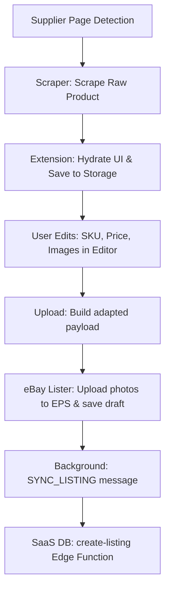

# SellerSuit Data Flow Map

This document maps the lifecycle of product data from initial page detection to scraping, local editing, storage state, eBay payload construction, and SaaS database synchronization.

---

## 1. High-Level Data Lifecycle Flow

---

## 2. Component Data Flows and Boundaries

### A. Product Detection & Scrape Flow
1. Content script detects a supported product page URL (via `manifest.json` matches).
2. The user clicks **"Load Product"** or **"Load Variations"** in the side panel.
3. A runtime message `SCRAPE_SINGLE` or `SCRAPE_VARIANTS` is dispatched to the content script.
4. **Scraping Boundary:**
   * **Amazon Scrape:** `amazon-variant-scraper.js` reads in-memory variables and programmatically clicks DOM swatch buttons (Phase 1) to trigger price updates. `amazon-xhrpatch.js` intercepts XHR responses, caches them in `buyboxCache`, and posts them back to the scraper.
   * **Walmart Scrape:** `walmart-variant-scraper.js` reads `__NEXT_DATA__` directly from the page DOM and builds the product payload instantly.
5. **Universal Schema Normalization:** Scraped data is structured into a universal object and returned to the side panel.

---

### B. Storage & Editing Flow
1. The side panel receives the scraped product data.
2. The data is saved under `chrome.storage.local.set({ currentProduct })`.
3. If the user clicks **"Open full editor"**, the side panel is closed, and `panel.html` is injected into the active page.
4. **Editing Boundary:**
   * `panel-extended.js` reads `currentProduct` from storage and populates the editor UI inputs (`#ssx-single-sku`, `#ssx-single-ebay`, etc.).
   * As the user edits inputs, the event listeners update the local state.
   * **State Syncing Bug:** The hidden inputs (`#ext-sku`, `#ext-price`) must receive values from the visible inputs, which then triggers `_saveExtEdits()` to update `currentProduct` in `chrome.storage.local`.

---

### C. eBay Upload & Adapt Flow
1. The user clicks **"Upload to eBay"** inside the editor.
2. `_handleSidebarUpload()` (in `panel-extended.js`) builds the `uploadProduct` payload:
   * Title wins: user manual edit $\to$ AI title $\to$ draft title $\to$ original.
   * SKU wins: user manual edit $\to$ generated SKU $\to$ draft SKU.
   * Price wins: user manual edit $\to$ calculated price $\to$ draft price.
3. The background service worker receives `import_ebay` and opens a new tab pointing to the eBay listing suggester page:
   `https://www.ebay.com/sl/prelist/suggest?uploadSessionId=xxx`
4. The product payload is saved in `chrome.storage.local` keyed by `uploadSessionId`.
5. On the eBay prelist page, `ebay_prelist.js` fetches the product using `uploadSessionId`.
6. **Data Adaptation (The SKU Bug Area):**
   * `SellerSuitUploader.run()` calls `adaptProduct(product)`.
   * **ERASURE:** `adaptProduct` normalizes the fields into eBay's internal schema but fails to map `product.ebaySku` onto the returned adapted object.
7. `updateListing()` receives the adapted object. Because `adapted.ebaySku` is missing, it falls back to `product.prod_id` (the raw ASIN), discarding the user's manual SKU edits.

---

### D. Image Flow & Upload
1. In `updateListing()`, the images are uploaded to eBay Picture Services (EPS):
   * **Strategy 0 (Base64 URL):** Used for user-edited or auto-watermarked canvas images. The base64 data URL is converted to binary and posted to `EpsBasic`.
   * **Strategy 1 (CDN URL):** Direct HTTP binary upload from the supplier's CDN.
   * **Strategy 2 (Proxy URL):** Fallback proxy through the SaaS server if direct fetch fails.
2. **XML Response Bug:** Strategy 0 expects XML response `<PhotoID>...</PhotoID>`, but `EpsBasic` returns semicolon-separated text `SUCCESS;photo_id`, causing Strategy 0 to throw an error and fall back to original images.

---

### E. Dashboard Sync Flow
1. Once the listing draft is successfully updated on eBay, `SellerSuitUploader.run()` invokes `_syncListingToDashboard()`.
2. This sends `SYNC_LISTING` with the listing data to the background script.
3. The background script calls the `create-listing` Edge Function:
   `AuthHelper.callEdgeFunction('create-listing', payload)`.
4. If this call succeeds, the listing is registered in the database and visible on the SaaS dashboard. If it fails, the listing exists on eBay but is missing from the dashboard.

---

## 3. Data Flow Integrity Map

| Data Transition Point | Original Data State | Transformed Data State | Potential Failure Point |
| :--- | :--- | :--- | :--- |
| **Amazon Swatches $\to$ Scraper** | DOM elements & dynamic JS variables | JSON arrays in `windowData` | Missed clicks clobber pricing, causing $999 default prices. |
| **Scraper $\to$ Chrome Storage** | Scraper-specific variation rows | `currentProduct.variants` (flat normalized array) | Whitespace or Unicode formatting differences break combination keys. |
| **Chrome Storage $\to$ Editor UI** | `currentProduct` database draft | Input fields (`value` attributes) | Out-of-sync hidden fields override visible fields during save. |
| **Editor UI $\to$ Background Tab** | Input values on DOM | `uploadProduct` under `uploadSessionId` | Stale tab parameters or tab activations clobber the active session ID. |
| **Background Tab $\to$ eBay Uploader** | `entry.product` in storage | `adapted` payload for `EpsBasic` | `adaptProduct` erases `ebaySku` from the adapted parent. |
| **Uploader $\to$ EPS Endpoint** | Base64 strings / CDN URLs | Semicolon-split string / XML | Strategy 0 XML regex match fails on semicolon-split response, breaking base64 uploads. |
| **Uploader $\to$ Supabase Sync** | Synced eBay Listing details | `create-listing` RPC insertion | Network failures or duplicate SKU violations cause database drops. |
