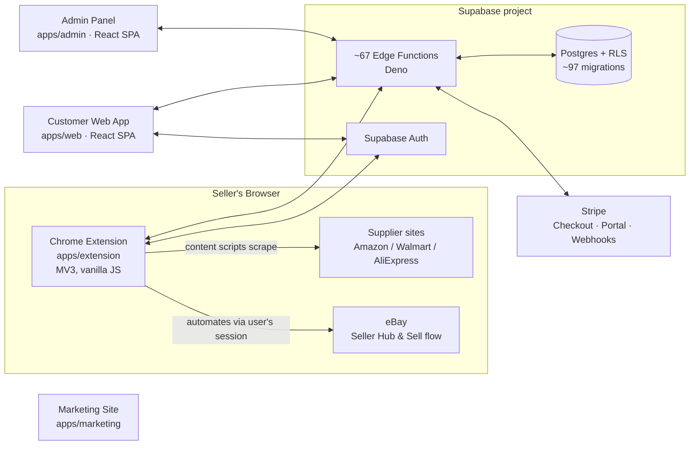

# SellerSuit

> **An eBay dropshipping automation SaaS.** SellerSuit helps eBay sellers source products from supplier marketplaces (Amazon, Walmart, AliExpress), auto-list them on eBay, keep prices and stock in sync, and manage orders, pricing rules, and billing from one dashboard.

This repository is an **npm-workspaces monorepo** containing every surface of the product: a Chrome extension (the primary product), a customer web app, an operator admin panel, a marketing site, and a Supabase backend.

---

## 🤖 Orientation for AI Agents

If you are an AI agent (or a new developer) landing in this repo, these are the facts that shape everything else:

1. **The product is eBay-only in scope.** Shopify code exists but is intentionally dormant behind a `SHOPIFY_ENABLED` flag — it is future scope. Do not delete it, and do not build on it.
2. **The Chrome extension is the primary product and the source of truth for eBay integration.** eBay is driven by **browser automation through the seller's own logged-in browser session** (scraping Seller Hub, posting listings *as the user*) — **not** the official eBay server-to-server API. The most common failure class is a stale eBay session/cookies.
3. **One shared Supabase backend serves every surface** — Postgres (with RLS), ~67 Deno Edge Functions, Supabase Auth. Stripe handles billing (Checkout + Customer Portal + webhooks).
4. **The extension is vanilla JavaScript (Manifest V3); everything else is React + TypeScript** built with Vite, shadcn/ui, and Tailwind.
5. **Deeper agent-oriented docs already exist** — see [Documentation Map](#documentation-map). Start with `CLAUDE.md` (dev commands & conventions), `PROJECT_CONTEXT.md` (context brief), and `PRODUCT_MODEL.md` (end-to-end domain model).

---

## What This Project Does

A seller's workflow through SellerSuit:

1. **Find & import** — While browsing a product page on Amazon, Walmart, or AliExpress, the extension scrapes product data (title, images, price, variations) via content scripts.
2. **List to eBay** — The product is turned into an eBay listing (single or bulk), with AI assists for titles and descriptions, pricing rules/markup applied, then posted to eBay through the seller's logged-in browser session.
3. **Stay in sync** — Prices and stock are monitored against the supplier; eBay orders are synced back into the dashboard.
4. **Manage the business** — The web dashboard covers listings, orders, auto-ordering (gated), product research, profit calculator, alerts, Google Sheets export, and subscription/billing.
5. **Operate the SaaS** — The admin panel lets operators manage users, plans, credits, feature flags, and extension devices.

Monetization: subscription plans (Trial → Starter → Pro) plus a **credit ledger** for metered actions, billed via Stripe.

---

## Architecture



- **Hosting:** Vercel for the three SPAs (`vercel.json` at root) · Chrome Web Store for the extension · Supabase for DB/functions/auth.
- **Data flow detail:** see `DATA_FLOW_MAP.md` and `PRODUCT_MODEL.md`.

---

## Monorepo Layout

```
apps/
  extension/   @sellersuit/extension  ⭐ Chrome extension (MV3, vanilla JS) — the primary product
  web/         @sellersuit/web        Customer dashboard (React SPA, dev port 3001)
  admin/       @sellersuit/admin      Operator/admin console (React SPA, dev port 3002)
  marketing/   @sellersuit/marketing  Config-driven marketing site (dev port 3000)

packages/                             Shared code, aliased in Vite as @repo/<name>
  auth/              AuthProvider, useAuth hook, ProtectedRoute
  api-client/        Supabase client singleton (reads VITE_SUPABASE_* env vars)
  ui/                shadcn/ui component library
  types/             Shared TS types + generated Supabase Database types
  marketplace-core/  Shared listing/product logic
  config/            Shared config
  utils/             Shared utilities

supabase/
  functions/   ~67 Edge Functions (Deno) — the entire server-side API
  migrations/  ~97 sequential SQL migrations (Postgres schema, RLS, triggers)
  tests/       Backend tests

services/      ⚠️ Scaffolding only (.gitkeep placeholders) — future marketplace
               adapters, sync workers, and webhooks. No real code yet.

PriceCompare/  Standalone experimental price-compare extension (separate from
               apps/extension; not part of the main build)

docs/          Audits, billing docs, operations runbooks, CI notes
scripts/       Repo-level check/QA scripts (env, security, workflow, edge functions)
e2e/           Playwright smoke tests (playwright.config.ts at root)
load-tests/    Load testing
*.md (root)    Extensive project docs — see Documentation Map below
```

---

## The Four Apps

### 1. `apps/extension` — Chrome Extension ⭐ (primary product)

**SellerSuit** (v1.4.x), Manifest V3, written in **vanilla JavaScript** (only supplier adapters + content-script injectors use small Vite bundles).

- **Supplier scraping:** content scripts on Amazon (all major TLDs), Walmart (.com/.ca), and AliExpress (.com/.ru/.us) extract product data. Supplier adapters live in `suppliers/` (`amazon/`, `walmart/`, `aliexpress/`, shared `core/`).
- **eBay automation:** content scripts on eBay's sell flow / Seller Hub create listings and read orders using the seller's live session.
- **Surfaces:** background service worker (`background/`), side panel UI (`sidepanel/`), options page.
- **Auth:** pairs with a web-app account via pairing codes/QR + device tokens (see `apps/extension/AUTHENTICATION.md` and `CONNECTION_GUIDE.md`).
- **Three manifests:** `manifest.json` (base), `manifest.dev.json`, `manifest.prod.json` — assembled by `prepare:dev` / `prepare:prod` into loadable builds under `dist/`.
- **Tests:** Node's built-in `node:test` runner — **no Jest/Vitest**.

### 2. `apps/web` — Customer Web App

React/TypeScript SPA (Vite, shadcn/ui, Tailwind, React Router, TanStack Query). The authenticated seller dashboard: eBay dashboard KPIs, listings management, new-listing flow, bulk lister, orders, auto-orders (gated), product research (AI), curated product lists, profit calculator, alerts, extension pairing, subscription/billing, and settings (AI keys, Google Sheets, WhatsApp).

### 3. `apps/admin` — Admin Panel

Separate React SPA for **operators** (not customers): user management (roles, credits, verification, deletion), plan configuration + Stripe plan sync, extension device/feature-flag administration, and curated-content management. Backed by the `admin-*` and `extension-admin-*` edge functions with role checks (`user` / `admin` / `super_admin`).

### 4. `apps/marketing` — Marketing Site

Config-driven public marketing/landing site. Deployed to Vercel; content updates can be triggered via the `trigger-marketing-deploy` function.

---

## Supabase Backend

The entire server side is **Supabase**: Postgres with row-level security, Supabase Auth, and ~67 Deno Edge Functions in `supabase/functions/`. Rough functional grouping:

| Domain | Example functions |
|---|---|
| Extension pairing & device auth | `extension-pairing-*`, `extension-connect-*`, `extension-token-*`, `extension-bootstrap`, `extension-config`, `extension-device-revoke` |
| Listings | `create-listing`, `get-listings`, `sync-listing`, `match-listing` |
| Orders | `ebay-orders`, `sync-ebay-orders`, `orders-dashboard`, `create-auto-order` |
| AI assists | `generate-titles`, `generate-description(-v2)`, `ai-image-edit`, `ai-product-research`, `product-intelligence` |
| Billing (Stripe) | `create-checkout`, `stripe-webhook`, `customer-portal`, `check-subscription-v2`, `reconcile-subscriptions`, `validate-coupon` |
| Pricing engine | `pricing-preview`, `pricing-rules-sync`, `pricing-settings`, `pricing-verify`, `get-calculator-settings` |
| Admin ops | `admin-adjust-credits`, `admin-plan-config`, `admin-sync-stripe-plans`, `admin-update-role`, `extension-admin-*` |
| Auth & profile | `auth-otp`, `auth-status`, `ensure-profile` |
| Aux integrations | `google_sheets_sync`, `whatsapp-config`, `send-inventory-notification`, `amazon-inventory-sync` |

Key domain-model facts (full detail in `PRODUCT_MODEL.md`):

- **Credits are an append-only ledger** (`credit_transactions`); a trigger recomputes `profiles.credits`. Never write balances directly.
- **Billing lifecycle:** signup → choose plan → `create-checkout` → Stripe → `stripe-webhook` → `user_plans` + ledger grant; a nightly `reconcile-subscriptions` job repairs drift. The Trial is a **one-time $1 charge**, not a Stripe subscription.
- **Workspaces are latent multi-tenancy** — one default workspace per user today; not a live multi-tenant feature.

---

## Getting Started

**Prerequisites:** Node.js 20+, npm (this repo uses npm workspaces; `package-lock.json` is the canonical lockfile), a Chromium browser for the extension.

```bash
git clone https://github.com/AbdullahAlMuti/sb1.git
cd sb1
npm install
```

Create a `.env` at the repo root (see `ENV_SETUP.md` for the current values):

```env
VITE_SUPABASE_URL="https://<project-ref>.supabase.co"
VITE_SUPABASE_PUBLISHABLE_KEY="<publishable key>"
```

### Run the apps

```bash
npm run dev              # customer web app  → http://localhost:3001
npm run dev:admin        # admin panel       → http://localhost:3002
npm run dev:marketing    # marketing site    → http://localhost:3000
```

### Run the extension

```bash
npm run prepare:extension:dev
# then in Chrome: chrome://extensions → Developer mode → "Load unpacked"
# → select apps/extension/dist/extension-dev/
```

Pair the extension with an account from the web app's **Extension Connect** page.

---

## Commands Reference (root)

| Command | What it does |
|---|---|
| `npm run dev` / `dev:web` / `dev:admin` / `dev:marketing` / `dev:extension` | Start a workspace dev server |
| `npm run build` | Build marketing + web + admin |
| `npm run typecheck` · `npm run lint` | TypeScript + ESLint across workspaces |
| `npm run check:local` | Pre-release gate: env check + static security scan + typecheck + lint + build + edge-function checks |
| `npm run check:extension` | Extension manifests check + tests + typecheck + lint |
| `npm run qa:local` | Full local QA: workflow check + `check:local` + `check:extension` + dev build |
| `npm run release:extension` | Full QA then production extension build + verification |
| `npx playwright test` | E2E smoke tests (`e2e/`) |

Extension-specific scripts (run inside `apps/extension/`): `npm test`, `npm run build`, `build:amazon` / `build:walmart` / `build:aliexpress`, `prepare:dev`, `prepare:prod`, `verify:prod`.

---

## Deployment

| Surface | Where | How |
|---|---|---|
| Web / Admin / Marketing | **Vercel** | `vercel.json` at root; see `DEPLOYMENT.md` |
| Extension | **Chrome Web Store** | `npm run release:extension` → upload; see `PRODUCTION_DEPLOYMENT_AND_CHROME_WEB_STORE.md` |
| Backend | **Supabase** | Edge functions + migrations via Supabase CLI/dashboard; see `DEPLOY_VIA_DASHBOARD.md` |

---

## Conventions & Gotchas (read before changing code)

- **eBay-only scope.** `SHOPIFY_ENABLED` gates dormant Shopify code — keep it, don't extend it.
- **eBay = browser automation**, not API. Changes to eBay flows must respect the "runs in the user's session" model; expect and handle stale-session failures.
- **Use npm**, not bun/yarn (a vestigial `bun.lockb` exists; `package-lock.json` is canonical and all scripts/docs use npm).
- **Extension code is vanilla JS** with `node:test` — don't introduce React/Jest there.
- **Shared packages are imported as `@repo/<name>`** (Vite aliases), while workspace names are `@sellersuit/<app>`.
- **Never mutate credit balances directly** — append to `credit_transactions`.
- **Schema drift exists:** some tables are used by code but missing from generated `Database` types (grep for `(supabase as any)`); regenerate types when touching the schema.
- **Migrations are sequential** — add new SQL files to `supabase/migrations/`, never edit applied ones.
- Run `npm run check:local` before considering any change done.

---

## Documentation Map

The repo carries extensive docs. The most useful entry points:

| Doc | Purpose |
|---|---|
| `CLAUDE.md` | Dev commands, structure, and conventions for AI coding agents |
| `AGENTS.md` | Instructions for AI agents working in this repo |
| `PROJECT_CONTEXT.md` | Paste-able project context brief for AI assistants |
| `PRODUCT_MODEL.md` | End-to-end product & domain model built from the real code (tables, workflows, lifecycles) |
| `DATA_FLOW_MAP.md` | How data moves between extension, apps, Supabase, and Stripe |
| `SPEC.md` / `DESIGN.md` | Product spec and design |
| `ENV_SETUP.md` | Environment variables & Supabase setup |
| `DEPLOYMENT.md`, `PRODUCTION_DEPLOYMENT_AND_CHROME_WEB_STORE.md` | Deployment guides |
| `docs/` | Audits, billing (`docs/BILLING.md`), operator runbooks, CI notes |
| `supabase/DESIGN.md` | Backend design |
| `apps/extension/AUTHENTICATION.md`, `CONNECTION_GUIDE.md` | Extension auth & pairing |
| `apps/extension/PRIVACY_POLICY.md`, `CHROME_STORE_DATA_SAFETY.md` | Store compliance |

---

## Tech Stack Summary

| Layer | Technology |
|---|---|
| Web apps (web / admin / marketing) | React 18, TypeScript, Vite, shadcn/ui (Radix), Tailwind CSS, React Router, TanStack Query, React Hook Form + Zod, Recharts |
| Chrome extension | Vanilla JavaScript, Manifest V3, small Vite bundles for supplier adapters, `node:test` |
| Backend | Supabase: Postgres (RLS), Deno Edge Functions, Supabase Auth |
| Billing | Stripe (Checkout, Customer Portal, webhooks, credit ledger) |
| AI features | Edge functions for titles/descriptions/image edit/product research |
| Testing | `node:test` (extension), Playwright (e2e), load tests |
| Hosting | Vercel (SPAs), Chrome Web Store (extension), Supabase (backend) |
