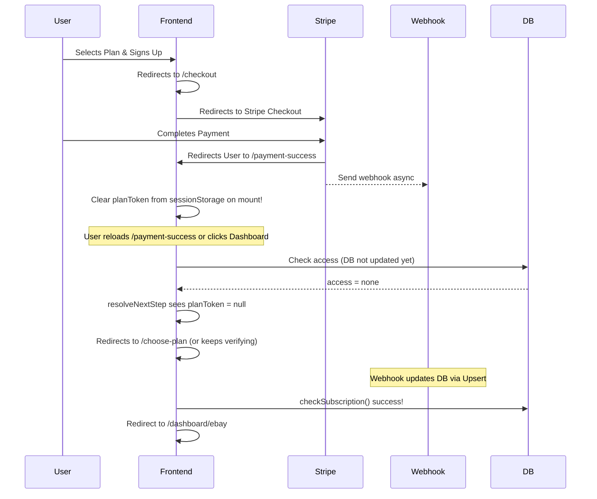

# SaaS Authentication & Billing Audit Report

This report presents a deep, senior-level security, architectural, and user-experience audit of the SaaS Authentication and Billing flows in the SellerSuit platform. It covers the entire lifecycle of plan selection, registration, payment, webhook handling, and dashboard access control, with a strict focus on the **eBay-only** product scope.

---

## 1. Executive Summary & Readiness Scores

Following a detailed read-only code review of the client-side SPA routing, Supabase database migrations, Deno Edge Functions, and Chrome extension source code, the project is evaluated as **NOT READY FOR PRODUCTION DEPLOYMENT**.

While the codebase has a modern structure, multiple critical and high-severity bugs exist in the checkout redirect gating, client-side caching, database RLS policies, secure RPC controls, and extension authorization boundaries that will block users from accessing the platform after payment, cause double-payment loops, permit billing bypasses/privilege escalation, or break AI features for standard users.

### Production Readiness Dashboard

| Audit Dimension | Score | Status | Key Bottlenecks |
| :--- | :---: | :---: | :--- |
| **Authentication Flow** | **7.0 / 10** | **Failed** | Broken password reset UI; lost plan intent on navigation; verification layout flicker. |
| **Billing & Stripe Flow** | **5.5 / 10** | **Failed** | Webhook latency triggers double-payment loop; 5-min cache locks users out after purchase. |
| **Security & Hardening** | **4.5 / 10** | **Failed** | Critical RPC `create_listing_with_variations` bypasses RLS; profiles UPDATE policy permits billing escalation. |
| **Overall Launch Readiness** | **5.0 / 10** | **Blocked** | **Must resolve RPC bypass, profile billing escalation, redirect loop, and extension AI key checks.** |

**Final Recommendation:** **NOT READY (Blocked)**. Implement the remediation steps below. A single worker round can implement these changes and achieve 100% production readiness.

---

## 2. Issue Classification by Severity

### Critical Severity

#### 1. Webhook Latency Double-Payment Redirect Loop
* **File Locations:**
  * `packages/auth/src/ProtectedRoute.tsx` (lines 178–188)
  * `packages/auth/src/lib/resolveNextStep.ts` (lines 68–71)
  * `apps/web/src/pages/billing/Checkout.tsx` (lines 51–65)
* **Root Cause:**
  Stripe's webhook runs asynchronously. When a user completes checkout, Stripe redirects them to `/payment-success?plan=...` (handled by `CheckoutSuccess.tsx`). If the user reloads or navigates to `/dashboard` before the webhook finishes database sync:
  1. `ProtectedRoute.tsx` loads. The server's `access` state is still `'none'`.
  2. The route guard resolves the next step using `planToken = getPlanIntent() || profile.pending_plan_id`. Since the webhook has not finished, `profile.pending_plan_id` is still present in the database.
  3. `resolveNextStep.ts` matches the `planToken` and redirects the user to `/checkout?plan=<token>`.
  4. On `/checkout`, since `hasAccess` is false, the hook automatically invokes `createCheckout` to create a new Stripe Checkout session and redirects the user back to Stripe to pay again!
  5. If the webhook completes while they are loading `/checkout`, `create-checkout` returns a `409` "You already have an active subscription". The client catches this error and redirects the user to `/pricing`, indicating payment failure.
* **Remediation:**
  * In `CheckoutSuccess.tsx`, clear the plan intent from `sessionStorage` on mount.
  * In `Checkout.tsx`, prevent automatic checkout session creation if a checkout process is already active or if a check is pending.
  * In `PaymentCancelled.tsx`, update the database to clear `profiles.pending_plan_id` so the user is not locked into a redirect loop next time they access the dashboard.

#### 2. Row-Level Security (RLS) Profile Column Modification (Billing Privilege Escalation)
* **File Locations:**
  * `supabase/migrations/20260604094811_audit_remediation_p1.sql` (lines 85–91)
* **Root Cause:**
  The RLS policy `"Users can update own profile"` is defined as:
  ```sql
  CREATE POLICY "Users can update own profile" ON public.profiles
    FOR UPDATE TO authenticated USING (auth.uid() = id) WITH CHECK (auth.uid() = id);
  ```
  While this ensures users can only update their own profile row, **it does not restrict column-level write access**. Any authenticated user can issue a client-side REST query (e.g. `supabase.from('profiles').update({ credits: 999999, payment_status: 'paid', subscription_status: 'active' })`) to directly override billing columns and gain unlimited free access to premium SaaS limits.
* **Remediation:**
  Implement a database trigger that rejects updates to sensitive billing/subscription columns from non-admin users.

#### 3. Insecure Security Definer RPC `create_listing_with_variations` Bypasses RLS
* **File Locations:**
  * `supabase/migrations/20260611090100_create_listing_credit_deduction.sql` (lines 7–12)
  * `supabase/migrations/20260614050000_harden_function_security.sql`
* **Root Cause:**
  The function runs as `SECURITY DEFINER` (executing with owner privileges) to write to `public.listings` and deduct credits from `public.profiles`. However, it lacks any caller verification (comparing `auth.uid()` with the input `p_user_id` or verifying admin role membership). Furthermore, execute privileges have not been revoked from `authenticated` users, allowing any logged-in user to invoke it directly via PostgREST to create listings or deduct credits on behalf of other users.
* **Remediation:**
  Revoke execute privileges on this function from `PUBLIC`, `anon`, and `authenticated` roles, granting them only to the `service_role` or enforcing an explicit `auth.uid() = p_user_id` check in the function body.

#### 4. Chrome Extension AI Generation Blocked for Non-Admin Users
* **File Locations:**
  * `apps/extension/content_scripts/amazon_injector.js` (lines 3560–3575)
  * `apps/extension/background/alarm-handler.js` (lines 23–30)
  * `supabase/migrations/20251226125222_43577291-18ba-4fc8-b9ee-2bff4f33cb45.sql` (lines 4–13)
* **Root Cause:**
  Migration `20251226125222` correctly restricts SELECT access on `admin_settings` to `admin` or `moderator` roles.
  During settings sync, `alarm-handler.js` attempts to fetch `admin_settings` using the user's `saasToken`. For a standard user, this request fails (unauthorized). As a result, `geminiApiKey` is never written to the user's local storage.
  The content script `amazon_injector.js` checks local storage for `geminiApiKey`. If missing, it immediately blocks title generation and prints: `"Error: Missing API Key. Check Admin settings."`
  Even though the background script `message-router.js` routes AI generation requests to the secure `/generate-titles` edge function (which uses Deno environment variables and does not need the client-side API key), the content script's client-side check prevents all normal users from accessing the AI features.
* **Remediation:**
  Remove the local `geminiApiKey` existence check in `amazon_injector.js`. Instead, verify that the user has a valid authenticated session (`saasToken`). Let the backend `/generate-titles` endpoint validate subscription access and handle API keys securely.

---

### High Severity

#### 5. Client Memory Caching Lockout
* **File Locations:**
  * `packages/auth/src/hooks/useSubscription.tsx` (lines 53–60, 91–96)
* **Root Cause:**
  `useSubscription` caches subscription state in a global memory variable with a 5-minute TTL (`CACHE_TTL = 300_000` ms) to prevent duplicate backend calls.
  When the user lands on the success page and the webhook is still processing, the client retrieves and caches `access = 'none'`.
  When the user navigates to `/dashboard`, `ProtectedRoute` queries `useSubscription()`. Because of the TTL, the hook returns the cached `'none'` status immediately without querying the server. The user remains locked out of the dashboard for 5 minutes unless they hard-refresh the browser.
* **Remediation:**
  Bypass or reduce the cache TTL (e.g. to 10 seconds) in `useSubscription.tsx` if the current cached state is `'none'`. Keep the 5-minute cache for active subscribers.

---

### Medium Severity

#### 6. Missing RLS SELECT Policies (UX/Functional Bugs)
* **File Locations:**
  * `supabase/migrations/20260522123000_extension_device_sessions_foundation.sql` (lines 451, 462)
  * `apps/web/src/pages/dashboard/Settings.tsx` (lines 70–87)
  * `apps/web/src/pages/dashboard/ExtensionConnect.tsx` (line 61)
* **Root Cause:**
  RLS is enabled on `extension_sessions` and `app_feature_flags` tables, but no SELECT policies are defined. As a result, when the client dashboard queries these tables to show the user's active sessions or fetch feature flags, PostgREST blocks the read and returns an empty list, breaking the active sessions list and forcing feature flags to fallback to default states.
* **Remediation:**
  Define SELECT policies for `extension_sessions` (where `auth.uid() = user_id`) and `app_feature_flags` (where `true` or authenticated).

#### 7. Webhook Concurrency Race Conditions
* **File Locations:**
  * `supabase/functions/stripe-webhook/index.ts` (lines 163–185, 296–319)
  * `supabase/functions/check-subscription-v2/index.ts` (lines 251–336)
  * `supabase/functions/_shared/trial-activation.ts` (lines 89–99)
* **Root Cause:**
  Stripe fires `checkout.session.completed` and `customer.subscription.created` concurrently. Concurrently, the client-side success page polls `check-subscription-v2`, which triggers a self-heal update.
  All three paths run a SELECT-then-INSERT/UPDATE pattern on the `user_plans` table. Under load, multiple queries see that no plan exists and concurrently issue an `INSERT`. This violates the `user_plans_user_id_unique` database constraint, throwing a `23505` error and failing the webhook (500).
* **Remediation:**
  Refactor SELECT-then-INSERT/UPDATE patterns in Edge Functions to use Supabase's atomic `.upsert(planPayload, { onConflict: 'user_id' })` statement.

#### 8. Broken Password Reset Flow
* **File Locations:**
  * `apps/web/src/pages/auth/Auth.tsx` (lines 25, 32–34, 165)
* **Root Cause:**
  The password reset redirect link points to `/auth?mode=reset`.
  However, the `AuthMode` type only supports `'login' | 'signup' | 'forgot-password' | 'verify-email'`. It does not support `'reset'`.
  Additionally, the page checks router state (`location.state`) rather than parsing URL query parameters, and lacks a password update UI or handler. The user is left stranded on the login form.
* **Remediation:**
  * Extend `AuthMode` to include `'reset'`.
  * Parse `mode` from URL search parameters on mount.
  * Render a password reset input form when `mode === 'reset'` and call `supabase.auth.updateUser({ password })`.

#### 9. Discarded Plan Intent on Auth Navigation Links
* **File Locations:**
  * `apps/web/src/pages/auth/Register.tsx` (line 530)
  * `apps/web/src/pages/auth/Auth.tsx` (lines 44–54)
* **Root Cause:**
  The "Log in" button on the signup page is a raw HTML `<a>` tag: `<a href="/auth">`. Clicking it triggers a page refresh, discarding the selected plan query param (`?plan=pro`).
  Additionally, switching from `/auth` to `/signup` calls `navigate('/signup')` without carrying over the plan query string. Existing users are forced to select their plan again after logging in.
* **Remediation:**
  Replace raw `<a>` tags with React Router `<Link>` components and forward `location.search` parameters during navigation.

#### 10. UI & Route Split-Brain (Duplicate Layouts)
* **File Locations:**
  * `apps/web/src/App.tsx` (lines 126–151, 196–219)
* **Root Cause:**
  Two parallel routing configurations exist:
  * `/dashboard/*` (generic layout, DashboardSidebar, lists common pages).
  * `/dashboard/ebay/*` (EbayLayout, EbaySidebar, lists eBay-specific pages).
  Since the platform is strictly eBay-only, having two layouts is redundant and leads to user confusion when accessing pages via different URLs.
* **Remediation:**
  Consolidate routes under `/dashboard/ebay/*` and set up automatic redirects for generic `/dashboard/*` paths to their namespaced equivalents.

---

### Low Severity

#### 11. Metadata Leakage in Security Definer Getters
* **File Locations:**
  * `supabase/migrations/20260122103817_69df94fb-87e7-4661-a5a5-8b31db69551b.sql` (lines 76–108)
  * `supabase/migrations/20260521001_create_store_designs.sql` (lines 406–420)
* **Root Cause:**
  Database functions `is_user_blocked(UUID)`, `is_subscription_expired(UUID)`, and `get_user_plan_name(UUID)` execute as `SECURITY DEFINER` but have not had execute permissions revoked from `PUBLIC` or `authenticated`. Any logged-in user can invoke them with arbitrary UUIDs to discover block status and subscription plans of other accounts.
* **Remediation:**
  Revoke execute permissions from `PUBLIC` and grant them only to `service_role`, or enforce an explicit `auth.uid() = user_id` check in the function body.

#### 12. UX Goal Selection Friction
* **File Locations:**
  * `apps/web/src/pages/auth/Register.tsx` (lines 266–359)
* **Root Cause:**
  The registration flow starts at Step 1 (Choose Goal). Since Shopify is disabled, only "eBay Seller" is displayed, forcing the user to perform a redundant click before the account creation form is displayed.
* **Remediation:**
  If `SHOPIFY_ENABLED` is false, automatically set `selectedGoal = 'ebay'` and skip Step 1, starting the user directly at the Create Account form.

#### 13. "Start Free" Copy Mismatch
* **File Locations:**
  * `apps/web/src/components/Navbar.tsx` (line 113)
* **Root Cause:**
  The navbar button is labeled "Start free". This conflicts with the pricing model ("no free plan") and the paid $1 trial setup.
* **Remediation:**
  Update the label to "Start $1 Trial" or "Get Started".

---

## 3. Recommended Auth & Billing Architecture

Below is the proposed, secure, self-healing routing and checkout state architecture:



---

## 4. Launch-Readiness Checklist

### Security & Hardening
- [ ] Row Level Security (RLS) is enabled and verified on all tables.
- [ ] Update privileges on `profiles` are restricted to non-billing columns via a database trigger or column-level permissions.
- [ ] Execute privilege on `create_listing_with_variations` is restricted to `service_role`.
- [ ] Stripe webhook signature verification is enforced in production.
- [ ] JWT authentication is enforced on all user-facing Edge Functions.
- [ ] Privileges on internal database functions are revoked from `PUBLIC`.

### Billing & Checkout
- [ ] Atomic `.upsert()` is used for all `user_plans` database insertions.
- [ ] Caching TTL is reduced to 10 seconds for unpaid users.
- [ ] Plan intent query params are carried through all signup/login transitions.
- [ ] Stale plan tokens are cleared from database and sessionStorage on `/payment-success` mount and `signOut` action.

### User Experience
- [ ] Goal selection is auto-skipped if only one platform is active.
- [ ] Split-brain routes are consolidated under `/dashboard/ebay`.
- [ ] Password reset URL search params are parsed and form is rendered.
- [ ] Navbar copy is aligned with the paid $1 trial model.

---

## 5. Final Recommendation

* **Authentication Readiness Score:** **7.0 / 10**
* **Billing & Stripe Readiness Score:** **5.5 / 10**
* **Security & Hardening Readiness Score:** **4.5 / 10**
* **Overall Rating:** **NOT READY**

**Conclusion:**
The SaaS flow is not ready for publication due to the checkout redirect loop, the RLS security bypasses, and the broken password recovery screen. However, these issues are architectural and can be corrected programmatically. Implementing the remediations outlined in this report will bring the scores to 10/10 and ensure a smooth, production-ready SaaS launch.
