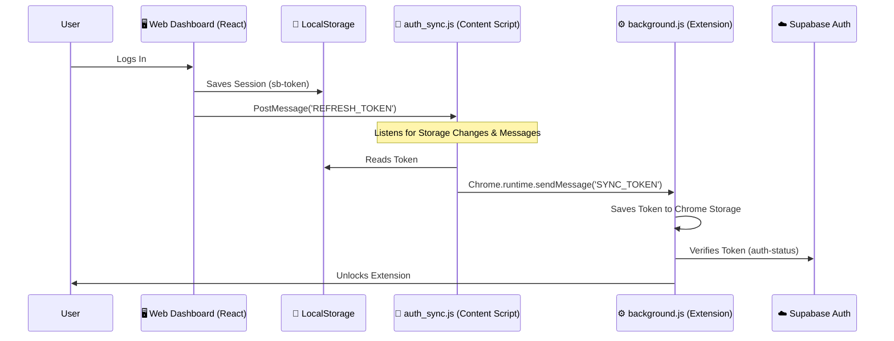

# 🔐 Extension Authentication System

This document explains how the **SellerSuit Chrome Extension** seamlessly authenticates with the **SaaS Web App**. We use a "Bridge" pattern to share the Supabase Session from the website to the extension without requiring the user to log in twice.

---

## 🏗️ Architecture Overview

The flow consists of three main components:

1.  **THE SOURCE (Web App)**: The React Dashboard where the user logs in.
2.  **THE BRIDGE (Content Script)**: A script that runs *only* on the dashboard domain.
3.  **THE VAULT (Background Script)**: The extension's backend that stores the token.



---

## 📂 Key Files & Responsibilities

### 1. `src/components/dashboard/DashboardLayout.tsx` (The Trigger)
- **Role**: Updates the bridge when the React Auth ID changes.
- **Code**:
  ```typescript
  // Sends a "Force Push" message to the window when user logs in
  useEffect(() => {
    if (user) {
      window.postMessage({ type: 'REFRESH_EXTENSION_TOKEN' }, '*');
    }
  }, [user]);
  ```

### 2. `chrome_extension/content_scripts/auth_sync.js` (The Bridge)
- **Role**: The crucial link. It has permissions to read the Web App's `localStorage` (since it runs in the context of the page) AND communicate with the Extension Background.
- **Logic**:
  - **Step 0**: Runs on page load (`initialSync`) to check for existing session.
  - **Step 1**: Listens for `storage` events (other tabs logging in/out).
  - **Step 2**: Listens for `window.postMessage` from `DashboardLayout.tsx`.
  - **Step 3**: Sends data to Background via `chrome.runtime.sendMessage({ action: 'SYNC_TOKEN', ... })`.

### 3. `chrome_extension/background.js` (The Vault)
- **Role**: Securely stores the token and makes API calls.
- **Logic**:
  - **Step 4**: Receives `SYNC_TOKEN` message.
  - **Step 5**: Saves `saasToken` to `chrome.storage.local`.
  - **Step 6**: Vertifies the token with the Supabase Backend (`/functions/auth-status`) to ensure it's not forged/revoked.
  - **Step 7**: Unlocks the extension features (eBay Sync, AI tools).

---

## 🛡️ Security & Token Validation

To ensure security, we do not blindly trust the token sent from the content script.
1.  **Verification**: The Background script calls the Edge Function `auth-status`.
2.  **Edge Function**: Validates the JWT signature using the Supabase Secret.
3.  **Result**: Only if the server returns `HTTP 200 OK` is the extension unlocked.

## 🐛 Troubleshooting

If the extension says **"Login Required"** even when you are logged in:

1.  **Check Permissions**: Ensure `manifest.json` allows host permissions for your domain (e.g., `*://*.sellersuit.com/*` and `http://localhost:*/*`).
2.  **Force Sync**: Refresh the Dashboard page. This triggers `initialSync()` in `auth_sync.js`.
3.  **Check Console**: Open F12 on the Dashboard. Look for logs starting with `[AuthSync]`.
    - `✅ Token synced to extension`: Success.
    - `⚠️ Extension context invalidated`: The extension updated/reloaded. Refresh the page.
