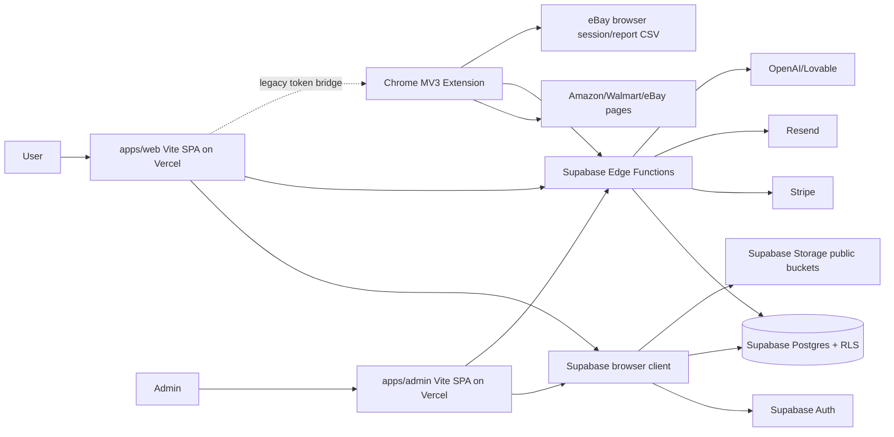
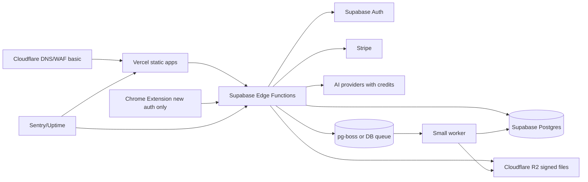
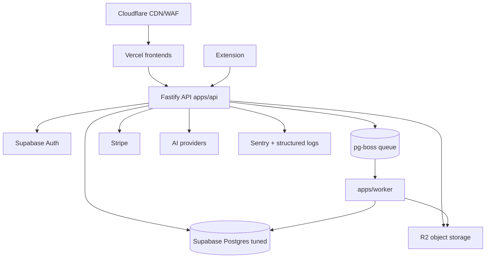
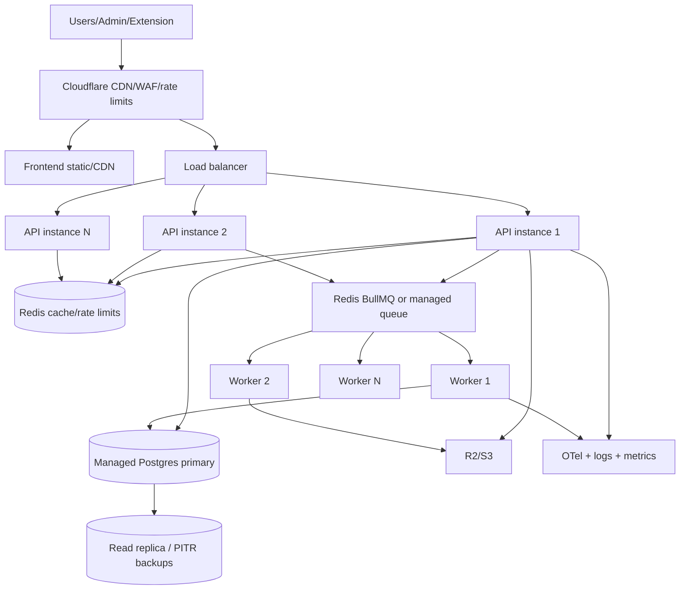
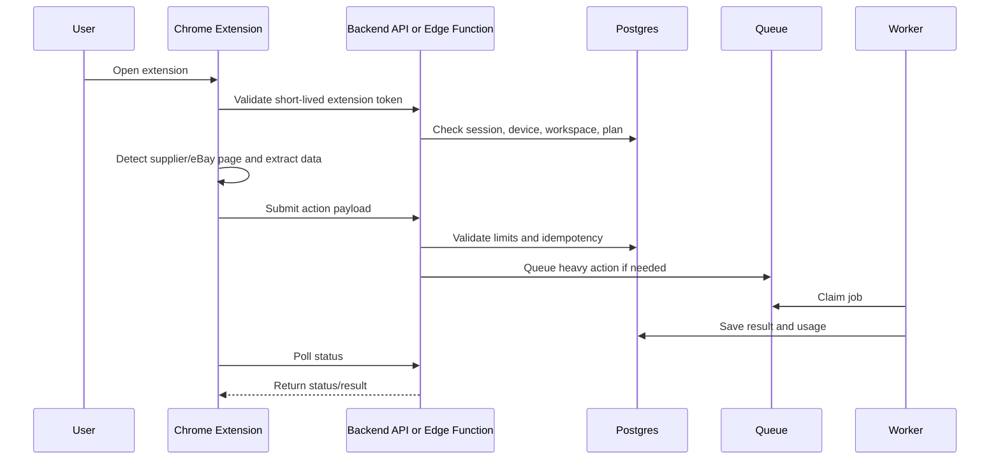
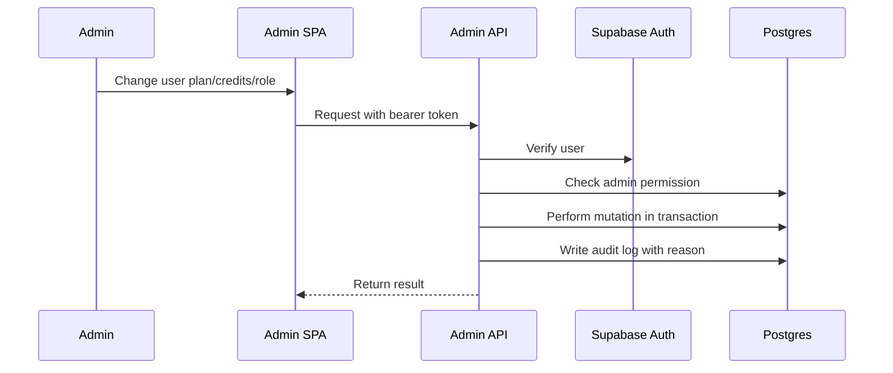
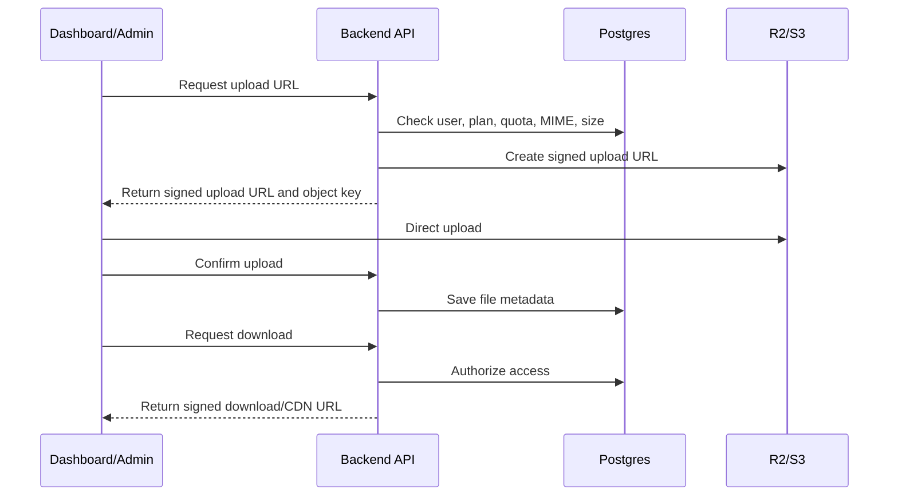
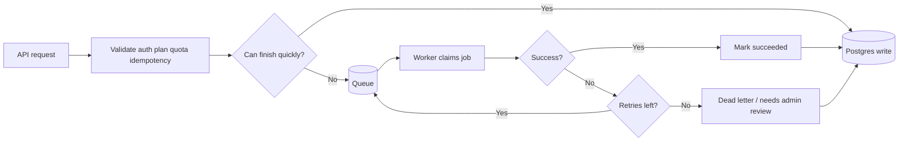
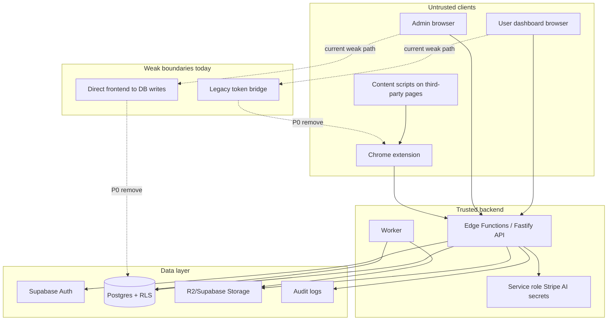

# SellerSuit SaaS Repository Technical Audit

Date: 2026-06-12

Scope: actual repository inspection for the AutoDS-style SellerSuit SaaS: Chrome extension, user dashboard, admin panel, marketing site, Supabase backend/functions/database/storage, Vercel/static deploy, billing, AI workflows, jobs, security, cost, and scaling path from MVP to 100-500, 1000, and 10000+ users.

Output rule used: facts cite real paths and line references. Where I infer intent, I label it `ASSUMPTION`.

## Blunt Executive Summary

Current architecture: Vite React apps (`apps/web`, `apps/admin`, `apps/marketing`) hosted as static SPAs on Vercel, Chrome MV3 extension in `apps/extension`, Supabase Auth/Postgres/Storage/Edge Functions as the main backend, Stripe billing functions, Resend email, AI gateway functions, and extension-side scraping/listing automation.

Production status: not production-ready yet. It is good enough for controlled beta/testing, but the trust boundary is still too loose for paid public launch.

100-500 users: achievable with the current stack after Phase 0/1 hardening. Do not rewrite the whole app. Fix the critical security/control items first.

1000 users: achievable with Supabase + Vercel + R2 + a small backend/worker layer. Start adding `apps/api` and `apps/worker` gradually.

10000+ users: not ready with the current shape. You will need a dedicated API layer, real queue/worker system, Redis or queue backend, managed Postgres with PITR, object storage, WAF/CDN, and centralized observability.

Final recommendation: keep Supabase and Vercel temporarily, but stop treating direct browser-to-DB access as the normal backend for privileged operations. For you as a solo developer, the best path is Hybrid now: Supabase Postgres/Auth/Functions for launch, Cloudflare R2 for storage, then a Fastify TypeScript API and pg-boss/DB queue first, Redis/BullMQ later.

## Verification Results

| Check | Current result | Evidence |
|---|---:|---|
| Static security script | Passed | `npm run security:static` |
| TypeScript check | Passed | `npm run typecheck` |
| npm audit | Passed, 0 vulnerabilities | `npm audit --audit-level=moderate` |
| Extension unit tests | Passed, 215 tests | `npm --prefix apps/extension test` |
| Lint | Failed, 422 errors and 36 warnings | `npm run lint`; examples include `packages/auth/src/components/auth/TurnstileCaptcha.tsx:18`, `apps/web/src/pages/dashboard/Listings.tsx:142`, `packages/auth/src/hooks/useSubscription.tsx:212` |

Important: typecheck passes, but `tsconfig.base.json:14-20` disables strict mode, strict null checks, no implicit any, unused checks, fallthrough checks, and allows JS.

## Phase A - Inventory

| Path | Exists? | What it does | Good / Risky | Should change | Priority |
|---|---:|---|---|---|---|
| `package.json:6-27` | Yes | NPM workspaces and scripts | Good: centralized build/typecheck/lint/security scripts | Add CI enforcement; lint currently fails | P1 |
| `package-lock.json` | Yes | NPM lockfile | Good | Keep one package manager; `bun.lockb` also exists | P2 |
| `bun.lockb` | Yes | Bun lockfile | Risk: package manager ambiguity | Choose npm for now unless intentionally switching | P2 |
| `turbo.json` | NOT FOUND | Turborepo config | No Turbo setup | Not needed now | P3 |
| `nx.json` | NOT FOUND | Nx config | No Nx setup | Not needed now | P3 |
| `pnpm-workspace.yaml` | NOT FOUND | pnpm workspace config | NPM workspaces are used instead | No change unless moving to pnpm | P3 |
| `apps/web/package.json:6-10` | Yes | User dashboard Vite app | Good for static SPA | Keep; backend is elsewhere | P2 |
| `apps/admin/package.json:6-10` | Yes | Admin Vite app | Risk: admin app has direct DB writes | Move admin mutations server-side | P0 |
| `apps/marketing/package.json:6-10` | Yes | Marketing Vite app | Good | Keep static | P3 |
| `apps/extension/manifest.json:2-15` | Yes | Chrome MV3 extension | Good foundation | Reduce auth risk and review broad permissions | P0 |
| `apps/web/public/chrome_extension/manifest.json:2-41` | Yes | Published extension copy | Risk: duplicate source of truth | Generate from `apps/extension` only | P1 |
| `packages/api-client/src/supabase/client.ts:1-24` | Yes | Supabase browser client | Good: publishable key; Risk: localStorage session/direct DB access | Use API client for privileged workflows | P0 |
| `packages/auth/src/hooks/useAuth.tsx:65-271` | Yes | Auth/session/roles | Good: login context checks; Risk: client role use | Server-side RBAC for privileged actions | P0 |
| `packages/auth/src/ProtectedRoute.tsx:150-151` | Yes | Route protection | Risk: payment gate is disabled | Re-enable when paid launch begins | P1 |
| `supabase/functions` | Yes, 59 dirs | Edge Functions backend | Good coverage | Consolidate middleware and CORS | P1 |
| `supabase/migrations` | Yes, 65 files | DB schema/RLS/functions | Good hardening work | Run Supabase advisors before launch | P0 |
| `supabase/config.toml:4-115` | Yes | Edge Function JWT config | Good: exceptions documented | Review every `verify_jwt=false` endpoint | P0 |
| `vercel.json:2-7` | Yes | Static output and SPA fallback | Risk: no security headers/CSP | Add headers | P0 |
| `apps/*/vercel.json:2-6` | Yes | SPA fallbacks | Same risk | Add headers per app | P0 |
| `.env.example:1-25` | Yes | Env template | Good | Keep secrets as placeholders only | P2 |
| `.env.local.example:8-32` | Yes | Local env template | Good | Keep real keys out of git | P2 |
| `.env` and `.env.local` | Yes, untracked | Local secrets | Good: not tracked | Do not commit; rotate if ever exposed | P0 |
| `.github/workflows/*` | NOT FOUND | CI/CD | Risk: no visible GitHub CI | Add CI after P0 fixes | P1 |
| `Dockerfile` / `docker-compose*.yml` | NOT FOUND | Container deploy | Not needed for current Vercel/Supabase | Add when `apps/api`/`apps/worker` exists | P2 |
| `scripts/static-security-checks.mjs` | Yes | Custom security regression checks | Strong | Keep and expand | P1 |
| `scripts/production-target-guard.mjs` | Yes | Production target guard | Strong | Add to CI | P1 |
| `docs/architecture-audit/*` | Yes | Older audit docs | Useful context | Do not treat as source of truth without code checks | P3 |

## Phase B - Current Working Method

### User/dashboard flow

The user dashboard is a Vite SPA. It talks directly to Supabase through `packages/api-client/src/supabase/client.ts:21-24`, which creates a browser Supabase client with localStorage auth persistence. Auth and roles are loaded in `packages/auth/src/hooks/useAuth.tsx:65`, `128`, `159-271`.

The dashboard makes direct table calls for normal user features:

| Flow | Evidence | Assessment |
|---|---|---|
| Plan/credit/listing counts | `packages/auth/src/hooks/usePlanLimits.tsx:41-43` | Acceptable for reads if RLS is perfect; exact counts can become slow |
| Dashboard metrics | `apps/web/src/pages/dashboard/Dashboard.tsx:207-238` | Uses direct counts/queries; fine for MVP, optimize later |
| Bulk lister inbox | `apps/web/src/pages/dashboard/BulkLister.tsx:163-462` | Direct CRUD on `bulk_job_items`; OK only with strict owner RLS |
| Profitable products | `apps/web/src/pages/dashboard/ProfitableProducts.tsx:109` | Direct read of published product content |
| Extension connect flags | `apps/web/src/pages/dashboard/ExtensionConnect.tsx:61` | Direct feature-flag read; hardcoded function URLs at `110` and `152` |

### Extension flow

The extension is Manifest V3 (`apps/extension/manifest.json:2`) with broad permissions (`apps/extension/manifest.json:7-15`) and hosted source copy under `apps/web/public/chrome_extension`. It runs supplier/eBay content scripts, background service worker logic, side panel, local queue state, and calls Supabase functions.

Current auth has two modes:

| Auth mode | Evidence | Risk |
|---|---|---|
| New opaque extension tokens | `apps/extension/common/auth-helper.js:108-119`, refresh at `390-405` | Good direction |
| Legacy dashboard token bridge | `apps/extension/content_scripts/bridge.js:47-97`, `apps/extension/common/config.js:101-103`, `apps/extension/common/auth-helper.js:169-176` | Critical: copies dashboard access/refresh token into extension storage and accepts stale legacy token |

The extension syncs orders by using the user's eBay browser session (`apps/extension/common/sync-utils.js:236-286`) and then posts parsed data to `sync-ebay-orders` (`apps/extension/common/sync-utils.js:662`). Bulk listing uses a local extension queue and MV3 alarms (`apps/extension/background/listing-runner.js:4-17`, `492-511`).

### Admin flow

Admin has server functions for some actions (`apps/admin/src/pages/AdminUsers.tsx:254`, `352`, `447`) but still directly mutates privileged tables:

| Direct mutation | Evidence | Finding |
|---|---|---|
| Toggle user active | `apps/admin/src/pages/AdminUsers.tsx:312-313` | P0 direct admin write |
| Insert audit log from browser | `apps/admin/src/pages/AdminUsers.tsx:322`, `423`, `512`, `653` | P0 audit integrity risk |
| Update profile details | `apps/admin/src/pages/AdminUsers.tsx:386-387` | P0 direct admin write |
| Update/insert user plans | `apps/admin/src/pages/AdminUsers.tsx:396-414`, `556-568`, `629-640` | P0 direct billing/plan write |
| Adjust credits | `apps/admin/src/pages/AdminUsers.tsx:486-495` | P0 direct money/credit write |

### Backend/Edge Functions

Supabase is the backend. `supabase/config.toml:4-115` shows JWT-verified functions and intentionally public/custom-token functions. Good examples exist:

| Function | Good evidence | Concern |
|---|---|---|
| Checkout | `create-checkout/index.ts:77`, `108-118`, `168-286` | Good pattern: origin check, limited JSON, server-derived Stripe price |
| Stripe webhook | `stripe-webhook/index.ts:23-27`, `108-131` | Signature verified, but no event-id idempotency table found |
| Google sheets sync | `google_sheets_sync/index.ts:70-100`, `144-182` | Good SSRF allowlist/timeout; returns app errors with `status: 200` |
| Create listing | `create-listing/index.ts:288-393` | Auth, entitlement, limits, RPC; CORS wildcard at `4-7` |
| AI title/description | `generate-titles/index.ts:85`, `generate-description/index.ts:115` | Entitlement exists; raw/body/AI response logs at `generate-titles/index.ts:97`, `345` |
| AI image edit | `ai-image-edit/index.ts:19-82` | Auth/rate limit exists; no entitlement/credit deduction found |

### Database/RLS

Core tables have RLS enabled in `supabase/migrations/20251226021050_remix_migration_from_pg_dump.sql:969-1065`. Later hardening adds `WITH CHECK` for owner updates in `supabase/migrations/20260604094811_audit_remediation_p1.sql:60-99`, atomic RPCs with `FOR UPDATE` around `126`, `135`, `312`, `321`, and revokes privileged function execute grants at `457-523`.

### Storage

Storage is currently Supabase Storage:

| Bucket/use | Evidence | Finding |
|---|---|---|
| Store design images | `supabase/migrations/20260521001_create_store_designs.sql:338-397` | Public read, admin write, allowed MIME/size configured |
| Product images | `supabase/migrations/20260126204006_76ce6406-1bb7-4703-820b-554bfe32e7f3.sql:150-194` | Public read product assets |
| Admin upload | `apps/admin/src/pages/shopify-app/hooks/useStoreDesigns.ts:467-492` | Direct admin upload to public bucket |
| Template download | `supabase/functions/get-template-url/index.ts:168-191` | Good signed URL pattern |

NOT FOUND: central `files` metadata table, R2/S3 signed upload flow, user-private object storage workflow, malware scanning, orphan cleanup job.

### Jobs/queue

There is a `background_jobs` table (`supabase/migrations/20260604094811_audit_remediation_p1.sql:25-58`) and internal-secret `queue-worker` (`supabase/functions/queue-worker/index.ts:17`, `40-76`). This is a starter claim mechanism, not a production queue system. Extension also has local queues (`apps/extension/background/bulk-core.js:32-60`, `apps/extension/background/listing-runner.js:4-17`).

NOT FOUND: Redis/BullMQ, pg-boss package, RabbitMQ, Temporal, worker app, queue dashboard, dead-letter processor.

## Phase C - Architecture Readiness

| Area | Current Status | 100 | 500 | 1000 | 10000+ | Main Problem |
|---|---|---:|---:|---:|---:|---|
| Frontend | Vite SPAs on Vercel | Good | Good | Good | Good with CDN | Not bottleneck |
| Admin panel | Feature-rich but direct DB writes | Risky | Risky | Unsafe | Unsafe | Privileged writes in browser |
| Extension | Powerful MV3 extension | Good after auth fix | Good after auth fix | Needs version/abuse controls | Needs backend job model | Legacy token bridge |
| Backend | Supabase Edge Functions | OK | OK | Needs API layer | Insufficient alone | Split logic/direct DB |
| Database | Supabase Postgres + RLS | Good | Good | Good if tuned | Needs managed scale/PITR | Direct access and advisor gap |
| Storage | Supabase public buckets | OK for public assets | OK | Needs R2 private flow | Needs lifecycle/CDN | No private file model |
| Auth | Supabase Auth + OTP | Good | Good | Good with server RBAC | Maybe keep or migrate | Extension token bridge |
| Queue/jobs | DB starter + extension local | Minimal | Minimal | Needs pg-boss/worker | Needs Redis/BullMQ/worker fleet | No real worker processing |
| Worker system | NOT FOUND as app | Missing | Missing | Needed | Required | Long jobs in extension/functions |
| Security | Some strong controls | Needs P0 fixes | Needs P0 fixes | Needs admin/API boundary | Needs WAF/alerts | Trust boundary gaps |
| Monitoring | Console/audit logs | Weak | Weak | Needs Sentry/logs | Needs OTel/metrics | No central observability |
| Cost control | Partial rate limits/credits | OK after AI fix | OK | Needs usage ledger | Needs quotas/alerts | AI image unmetered |
| Deployment | Vercel + Supabase | Good | Good | Add API/worker deploy | Multi-instance | No CI/Docker/workflows |
| Maintainability | Typecheck passes, lint fails | Risky | Risky | Must improve | Blocking | Loose TS and lint debt |

## Phase D - Decision Tables

### Backend Decision

| Option | Pros | Cons | Cost | Complexity | Good 100-500? | Good 1K+? | Good for AutoDS automation? | Pick |
|---|---|---|---:|---:|---:|---:|---:|---|
| Keep Supabase-only | Already built; low ops | Direct DB/admin split; Edge limits; queue weak | $25-$150/mo base | Low | Yes after P0 | Weak | Medium | No as final |
| Next.js API routes | Familiar if moving frontend | You are Vite now; not ideal for workers | $20-$200+/mo | Medium | Maybe | Medium | Medium | No |
| NestJS | Strong structure | More boilerplate solo | $10-$100/mo infra | High | Overkill now | Good | Good | No for now |
| Fastify | Fast, TypeScript, simple | Less opinionated | $10-$100/mo infra | Medium | Yes | Yes | Yes | Yes, later |
| NestJS+Fastify | Structure + performance | Too much now | $20-$150/mo infra | High | No | Yes | Yes | Not now |
| Go | Fast, cheap | New language/runtime overhead | $10-$100/mo infra | High | No | Yes | Yes | No |
| Django | Batteries included | Python stack mismatch | $10-$150/mo infra | High | No | Yes | Medium | No |
| Convex | Very fast product backend | Vendor/data model lock-in; mismatch with existing Supabase SQL/RLS | Usage-based | Medium | Maybe | Unknown | Medium | No |
| Firebase | Fast auth/db | Data model migration, lock-in | Usage-based | Medium | No | Medium | Weak for SQL flows | No |
| Appwrite | Self-host control | Adds ops; no need now | VPS cost | Medium | No | Medium | Medium | No |
| Hono | Simple edge API | Smaller full-backend ecosystem | Low | Medium | Maybe | Medium | Medium | Not main |
| Hybrid Supabase + own backend gradually | Low rewrite risk; fixes trust boundary | Two systems during migration | $35-$250/mo early | Medium | Yes | Yes | Yes | Pick |

Final backend: Hybrid now, add Fastify TypeScript API gradually. Keep Supabase functions for checkout/auth/extension while moving admin mutations, extension actions, usage, storage signing, and job creation behind `apps/api`.

Direct answers:

| Question | Answer |
|---|---|
| Next.js backend? | No. Your repo is Vite static; do not rewrite frontend just to get API routes. |
| Go? | No for now. Solo dev speed and existing TS code matter more. |
| Django? | No. Wrong stack for this repo. |
| Convex? | No. You already have SQL/RLS/migrations and need control. |
| NestJS? | Later only if team grows. |
| Fastify? | Yes, best future API choice for you. |
| Keep Supabase functions for now? | Yes. |
| Migrate gradually? | Yes. This is the safest path. |

### Database Decision

| Option | Pros | Cons | Cost | Maintenance | Backup safety | Good 100-500? | Good 1K+? | Pick |
|---|---|---|---:|---:|---:|---:|---:|---|
| Supabase Postgres | Already integrated, RLS, auth, functions | Vendor coupling; direct Data API risk | ~$25-$150/mo early | Low | Good on paid plan | Yes | Yes | Pick for 100-1000 |
| Self-hosted PostgreSQL | Cheapest/control | Backup/restore risk solo | $5-$40/mo | High | Weak unless disciplined | Maybe | Risky | No now |
| Managed PostgreSQL generic | Good ops/backups | Separate auth/functions | $15-$300/mo | Low | Good | Yes | Yes | Later |
| Neon | Serverless Postgres | Migration/ops split from Supabase | free-$100+/mo | Low | Good | Yes | Yes | Alternative |
| DO Managed PG | Predictable cost | Less integrated than Supabase | ~$15-$300+/mo | Low | Good | Yes | Yes | 10K balanced |
| AWS RDS | Enterprise mature | More complexity/cost | $50-$1000+/mo | Medium | Excellent | Overkill | Yes | 10K/enterprise |
| PG on VPS via Coolify | Cheap/full control | Solo backup burden | $10-$60/mo | High | Risky | Maybe | Risky | Not first |

Final database:

| Stage | Pick | Why |
|---|---|---|
| 100-500 | Supabase Postgres paid project | Your RLS/functions/schema already live there |
| 1000 | Supabase Postgres, tune indexes/advisors/backups | Lowest migration cost |
| 10000+ | Managed Postgres: Supabase higher plan or DO Managed PG/RDS | Need PITR, scaling, support, replicas if needed |

Plain answer: do not self-host Postgres now. Managed PG first.

Database audit highlights:

| Area | Current evidence | Finding |
|---|---|---|
| RLS | `20251226021050...sql:969-1065` | Core RLS exists |
| RLS update hardening | `20260604094811...sql:60-99` | Good `WITH CHECK` remediation |
| Atomic usage | `20260604094811...sql:126`, `135`, `312`, `321` | Good lock-based RPC direction |
| Direct browser writes | `AdminUsers.tsx:312-653` | P0 risk |
| Background jobs | `20260604094811...sql:25-58` | Starter only |
| Rate limits | `20260604102100...sql:1-18` | Good DB-backed starter |
| Missing idempotency | `stripe-webhook/index.ts:131` logs event id | NOT FOUND: `stripe_events` insert guard |
| Slow query risk | `AdminDashboard.tsx:140-144`, `Dashboard.tsx:207-238` | Exact counts at scale |

### Storage Decision

| Option | Pros | Cons | Cost | Control | Maintenance | Good 100-500? | Good 1K+? | Pick |
|---|---|---|---:|---:|---:|---:|---:|---|
| Supabase Storage | Already used; simple | Can become costly; public buckets only now | Low-med | Medium | Low | Yes for public assets | Limited | Keep for current public assets |
| Cloudflare R2 | Low egress cost, S3-compatible | New integration | Low | High | Low | Yes | Yes | Pick for user/private files |
| AWS S3 | Mature | Pricing/egress complexity | Med-high | High | Medium | Yes | Yes | Later enterprise option |
| Backblaze B2 | Cheap | Less integrated | Low | Medium | Low | Yes | Yes | Alternative |
| DO Spaces | Simple | Less advanced | Low | Medium | Low | Yes | Medium | Alternative |
| MinIO self-hosted | Control | Ops risk | VPS cost | High | High | No | Risky | No |
| VPS disk | Cheapest | Data loss/scaling risk | Low | High | High | No | No | No |

Final storage: keep Supabase Storage for current public product/store images; add Cloudflare R2 for user files, generated AI images, exports, private templates, and any future CSV/report artifacts.

Ideal storage flow:

1. UI asks backend for upload intent.
2. Backend validates user, workspace, plan, quota, MIME, size, and purpose.
3. Backend creates signed upload URL for R2.
4. Browser uploads directly to R2.
5. Browser confirms upload.
6. Backend writes metadata to `files`.
7. User/admin retrieves via signed download URL or CDN public URL.
8. Cleanup job deletes orphan uploads.

Current storage audit:

| Check | Status |
|---|---|
| Public/private buckets | Public buckets found at `store-design-images` and `product-images` |
| Signed URLs | Present for templates in `get-template-url/index.ts:181-183` |
| Files in DB risk | No large file-in-DB pattern found |
| User-private file metadata | NOT FOUND |
| R2/S3 signed upload | NOT FOUND |
| Orphan cleanup | NOT FOUND |
| Malware scanning | NOT FOUND |

### Queue/Worker Decision

| Option | Pros | Cons | Cost | Complexity | Good 100-500? | Good 1K+? | Pick |
|---|---|---|---:|---:|---:|---:|---|
| No queue | Simple | Fails for automation/AI/retries | $0 | Low | No | No | No |
| DB queue | Already partly present | Polling/locking limits | $0-$25 | Low | Yes | Medium | Short term |
| pg-boss | Postgres-native, reliable enough | Adds package/worker | $0-$25 | Medium | Yes | Yes | Pick first |
| Redis+BullMQ | Strong ecosystem | Redis dependency | $10-$100+ | Medium | Overkill now | Yes | Later |
| RabbitMQ | Robust | Ops-heavy | $10-$100+ | High | No | Yes | No |
| Temporal | Excellent workflows | Too complex solo | $0 self-host / managed high | High | No | Later maybe | No |

Final queue/worker: start with pg-boss or a proper DB queue because your DB queue table already exists. Move to Redis+BullMQ only when queue volume or latency requires it.

Move to worker first:

| Job | Current evidence | Move priority |
|---|---|---|
| AI image edits | `ai-image-edit/index.ts:19-82` | P0/P1 for cost/timeout control |
| Bulk listing status and retry coordination | `listing-runner.js:4-17` | P1 |
| eBay order sync processing | `sync-utils.js:662`; `sync-ebay-orders/index.ts:123-138` | P1 |
| Storage cleanup | NOT FOUND | P1 |
| Stripe webhook reconciliation | `stripe-webhook/index.ts:131-535` | P2 |

### Deployment Decision

| Option | Pros | Cons | Cost | Maintenance | Good solo dev? | Good 100-500? | Good 1K+? | Pick |
|---|---|---|---:|---:|---:|---:|---:|---|
| Vercel+Supabase | Already used, low ops | Weak for workers/full backend | $25-$150/mo | Low | Yes | Yes | Medium | Pick now |
| Coolify+VPS | Low cost/control | You own ops/backups | $10-$80/mo | Medium-high | Maybe | Yes | Yes | Pick for API/worker later |
| Dokploy+VPS | Similar Coolify | Less common | $10-$80/mo | Medium | Maybe | Yes | Yes | Not main |
| Docker Compose | Simple control | Manual ops | $10-$80/mo | Medium | Yes if comfortable | Yes | Medium | Later |
| Railway | Fast deploy | Usage pricing | $20-$200/mo | Low | Yes | Yes | Medium | Alternative |
| Render | Simple services | Can get costly | $20-$200/mo | Low | Yes | Yes | Medium | Alternative |
| Fly.io | Good regions | More ops | $20-$200/mo | Medium | Maybe | Yes | Yes | Alternative |
| Hetzner/Contabo/Hostinger VPS | Cheap | Ops risk | $5-$40/mo | High | Only if disciplined | Yes | Medium | Later with Coolify |
| Fully self-hosted | Control | Too much | Variable | High | No | No | Maybe | No |

Final deployment:

| Stage | Pick |
|---|---|
| 100-500 | Vercel + Supabase + Cloudflare DNS/WAF |
| 1000 | Vercel + Supabase + R2 + small Coolify/Fly/Render API/worker |
| 10000+ | Cloudflare + load-balanced API/worker + managed PG + Redis + R2/S3 |

Answer: use Coolify only when you add `apps/api` and `apps/worker`. Do not move the current static apps off Vercel just to save a few dollars.

## Phase E - Security Audit

| Issue | Severity | File/Area | Why risky | Fix | Priority |
|---|---|---|---|---|---|
| Admin direct DB writes | Critical | `apps/admin/src/pages/AdminUsers.tsx:312-653` | Browser/admin session can mutate users, plans, credits, audit logs; depends entirely on RLS/client integrity | Move all admin mutations to Edge Function/API; revoke client write paths | P0 |
| Legacy extension token bridge | Critical | `apps/extension/content_scripts/bridge.js:47-97`; `apps/extension/common/auth-helper.js:169-176`; `apps/extension/common/config.js:101-103` | Copies dashboard access/refresh tokens to extension storage and accepts stale legacy token | Enable new extension auth, disable legacy fallback, remove `SYNC_TOKEN` | P0 |
| Payment gate disabled | High | `packages/auth/src/ProtectedRoute.tsx:150-151` | Paid plan enforcement can be bypassed by design | Re-enable paid access gate or make free mode explicit with strict quotas | P0 |
| AI image edit unmetered | High | `supabase/functions/ai-image-edit/index.ts:19-82` | Auth/rate-limit exists, but no entitlement or credit deduction found | Add entitlement, quota, file size checks, credit deduction, logging | P0 |
| Generated HTML/XSS | High | `generate-description/index.ts:336-377`; extension `description-generator.js:352-356`; `amazon_injector.js:2805-2808`; `walmart_injector.js:2062-2063` | AI/user data becomes HTML and is rendered with `innerHTML` | Server sanitize allowlist + client DOMPurify/textContent where possible | P0 |
| Missing CSP/security headers | High | `vercel.json:2-7`, app Vercel configs `2-6`; NOT FOUND CSP | XSS blast radius is higher | Add CSP, HSTS, frame-ancestors, X-Content-Type-Options, Referrer-Policy | P0 |
| Wildcard CORS on sensitive/custom functions | Medium | `create-listing/index.ts:4-7`; `_shared/extension-session.ts:3-6` | Bearer token still protects, but origin control is weak | Use `_shared/cors.ts:67-73` allowlist where possible | P1 |
| Stripe webhook idempotency missing | Medium | `stripe-webhook/index.ts:131`, credit inserts at `199`, `353`, `409`, `467` | Stripe retries can duplicate credit/order transactions | Add `stripe_events` table and transaction guard | P1 |
| Hardcoded public Supabase anon/project config | Medium | `apps/extension/common/config.js:23-53`; `editor_core.js:1920` | Public key is not secret, but rotation/env coupling is bad | Build-time env injection + remote bootstrap | P2 |
| Verbose logs of AI/product data | Medium | `generate-titles/index.ts:97`, `345`; `ai-image-edit/index.ts:60` | Product/user data may leak into logs | Mask/truncate structured logs; remove raw AI response logging | P1 |
| Public storage not suitable for private files | Medium | `store-design-images` policies `20260521001...sql:335-397`; product images `20260126204006...sql:150-194` | If reused for user files, cross-user data exposure | Add R2 private signed flow | P1 |
| Lint/hook rule violation | Medium | `packages/auth/src/components/auth/TurnstileCaptcha.tsx:18` | Conditional hook can cause runtime bugs | Fix hook order | P1 |
| Service role leak in public code | Low | Search found env usages, no tracked service role value; `.env` untracked | No service-role value found in tracked source | Keep secret scan in CI | P1 |
| Old `auth.role()` policies | Low | `20260121201354...sql:8`, `15`; `20260122001954...sql:38`, `69` | Deprecated/confusing; service role bypasses RLS anyway | Clean or document in migration hardening | P2 |
| Backups not verified in repo | Medium | NOT FOUND backup workflow/runbook tied to current DB | Data loss risk | Enable provider backups and monthly restore drill | P1 |
| Monitoring not centralized | Medium | NOT FOUND Sentry/OTel config | Production issues invisible | Add Sentry and uptime checks | P1 |

## Phase F - Cost Control

ASSUMPTION: Costs below are rough USD monthly estimates for infrastructure only, based on official pricing pages checked on 2026-06-12. They exclude Stripe transaction fees, AI token/image costs, marketplace fees, support labor, and surprise traffic spikes.

| Scale | Lean stack cost | Safer stack cost | Notes |
|---|---:|---:|---|
| 100 users | $25-$80/mo | $60-$150/mo | Supabase paid project, Vercel/free or Pro, R2 mostly near-free, Sentry/free |
| 500 users | $50-$150/mo | $100-$300/mo | Add more DB/storage/AI budget; still no Redis needed |
| 1000 users | $100-$300/mo | $200-$600/mo | Add small API/worker service and R2; maybe Redis/Upstash if needed |
| 10000 users | $500-$2000+/mo | $1000-$5000+/mo | Managed DB, API/worker fleet, Redis, observability, WAF, AI budget dominate |

Cost risk by subsystem:

| Area | Current risk | Control |
|---|---|---|
| AI text | `generate-titles`/`generate-description` call AI providers | Plan credits, prompt size caps, cache, batch limits |
| AI image | `ai-image-edit` lacks entitlement/credits | Add per-plan image credits and queue |
| Storage | Public Supabase buckets only | R2 quotas, signed URLs, lifecycle cleanup |
| DB | Rate limits and exact counts write/read DB | Retention, rollups, Redis later |
| API | Extension can call frequently | user/IP/device/plan limits |
| Email | OTP abuse | Existing rate limits plus Turnstile |
| Logs | Raw AI/product logs | Sampling and retention |
| Extension automation | Bulk listing/order sync loops | Queue priority, daily action caps, retry caps |

How to feel unlimited while staying profitable:

| User-facing promise | Internal control |
|---|---|
| Unlimited product research | Soft cap + slow queue after threshold |
| Unlimited listings | Fair-use daily action cap + batch queue priority |
| Unlimited AI titles/descriptions | Monthly AI credits + generous rollover/bonus credits |
| Unlimited storage | Plan storage quota with "contact support" threshold |
| Fast sync | Higher plan gets shorter sync interval and higher queue priority |
| Admin goodwill | Admin override table with expiry and reason |

Concrete limits to add:

| Limit | Starter value |
|---|---|
| AI image edits | Free: 5/mo, Starter: 50/mo, Pro: 200/mo, higher after review |
| AI title generations | Free: 50/mo, Starter: 1000/mo, Pro: 5000/mo |
| Extension actions | per-user/day and per-device/minute |
| Bulk listings | batch size + active jobs per user |
| Storage | 1 GB starter, 5-20 GB paid, lifecycle delete orphan files |
| Retries | 3 automatic, then failed job status |

## Phase G - Three Target Architectures

### A - Minimum Practical 100-500 Users

| Component | Pick |
|---|---|
| Frontend/admin/marketing | Keep Vite SPAs on Vercel |
| Extension | Keep MV3, but disable legacy token bridge |
| Backend | Supabase Edge Functions |
| Database | Supabase Postgres paid project |
| Storage | Supabase public assets + start R2 for private/generated files |
| Queue | Proper DB queue/pg-boss starter |
| Worker | Small worker only for cleanup/AI/background tasks if needed |
| Monitoring | Sentry + uptime monitor |
| Backup | Supabase backups + monthly restore drill |
| Security | P0 fixes: admin API, extension auth, CSP, AI quota |
| Rough infra cost | $60-$150/mo plus AI/Stripe |

### B - Strong 1000 Users

| Component | Pick |
|---|---|
| Frontend | Vercel static apps |
| Backend | Supabase + `apps/api` Fastify for admin/extension/storage/usage |
| Database | Supabase Postgres tuned with indexes/advisors |
| Storage | R2 signed URLs; Supabase Storage only for existing public assets |
| Queue | pg-boss or DB queue with worker service |
| Worker | `apps/worker` Docker service |
| Cache | No Redis unless DB queue/rate limit becomes hot |
| Monitoring | Sentry + structured logs + basic metrics |
| Deployment | Vercel + Supabase + one VPS/Fly/Render service for API/worker |
| Rough infra cost | $200-$600/mo plus AI/Stripe |

### C - 10000+ Future

| Component | Pick |
|---|---|
| CDN/WAF | Cloudflare |
| API | Multiple Fastify/NestJS instances behind load balancer |
| Workers | Separate worker fleet |
| Database | Managed Postgres with PITR, backups, optional read replica |
| Queue | Redis+BullMQ or managed queue |
| Storage | R2/S3 with lifecycle rules |
| Monitoring | Sentry, OpenTelemetry, central logs, queue metrics |
| Security | WAF, admin 2FA, secrets rotation, audit export, alerting |
| Deployment | Container platform/VPS cluster/managed services |
| Rough infra cost | $1000-$5000+/mo plus AI/Stripe |

Summary table:

| Component | Current | 100-500 | 1K | 10K+ | Why |
|---|---|---|---|---|---|
| Frontend | Vite/Vercel | Keep | Keep | Keep/CDN | Not bottleneck |
| Admin | Vite/Vercel + direct DB | Server mutations | API mutations | Permission matrix | Security |
| Extension | MV3 + legacy fallback | New auth only | Version gates | Device fleet controls | Trust |
| Backend | Supabase Functions | Harden | Add Fastify API | Load-balanced API | Control |
| Database | Supabase PG | Keep | Tune | Managed PG/PITR | Reliability |
| Storage | Supabase public | Add R2 | R2 default | R2/S3 lifecycle | Cost |
| Auth | Supabase | Keep | Keep | Keep/migrate later | Avoid rewrite |
| Queue | Starter table/local | pg-boss | worker service | Redis/BullMQ | Jobs |
| Worker | NOT FOUND | Small worker | Required | Fleet | Reliability |
| Cache | NOT FOUND | None | Optional Redis | Redis | Hot paths |
| Monitoring | Console/audit | Sentry | Metrics | OTel/logs | Ops |
| Logs | Console | Structured | Centralized | Centralized | Debug |
| Billing | Stripe funcs | Add idempotency | Reconcile | Full ledger | Revenue |
| Email | Resend | Keep | Keep | Optional failover | Fine |
| Deployment | Vercel/Supabase | Keep | Add service | Multi-instance | Scale |
| Security | Partial | P0 fixes | 2FA/WAF | Mature controls | Safety |
| Backups | Not verified | Enable/test | Test monthly | PITR/DR | Survival |

## Phase H - Migration Roadmap

| Phase | Goal | Tasks | Files/Areas affected | Difficulty | Priority | Expected result |
|---|---|---|---|---|---|---|
| Phase 0 Stabilize | Remove launch blockers | Move admin credit/plan/profile changes server-side; disable legacy extension auth; add CSP; meter AI image edit; Stripe idempotency | `AdminUsers.tsx`, admin functions, `config.js`, `bridge.js`, `ai-image-edit`, `vercel.json`, `stripe-webhook` | Medium | P0 | Safer beta/launch |
| Phase 1 Ready 100-500 | Harden current Supabase stack | Use shared CORS/auth middleware; signed URL storage flow; Sentry; backup drill; Supabase advisors; quota UI | `supabase/functions`, migrations, storage hooks, env/deploy docs | Medium | P1 | Current stack can support early users |
| Phase 2 Own backend layer | Add API boundary | Create `apps/api`; modules: auth, admin, extension, usage, billing, storage; standard response format | New app, `packages/shared`, API client | High | P1 | Privileged logic leaves browser |
| Phase 3 Queue/worker | Reliable background jobs | Create `apps/worker`; pg-boss or DB queue; retries; failed jobs; job status UI | worker app, `background_jobs`, dashboard/admin job UI | Medium-high | P1 | Heavy tasks no longer block requests |
| Phase 4 Ready 1000+ | Tune and monitor | Indexes, query rollups, cost alerts, queue dashboard, structured logs | DB, API, monitoring | Medium | P2 | 1000-user stability |
| Phase 5 Ready 10000+ | Scale services | Managed PG/PITR/read replica, Redis/BullMQ, load-balanced API/worker, WAF, OTel | infra, API, worker, DB | High | P3 | High-scale architecture |

## Phase I - Mermaid Diagrams

### 1. Current Working Method

### 2. Recommended 100-500 Architecture

### 3. Recommended 1K Architecture

### 4. Future 10K+ Architecture

### 5. Extension Workflow

### 6. Admin Workflow

### 7. Storage Workflow

### 8. Queue/Worker Workflow

### 9. Security / Trust Boundary

## Final Decision

1. Final backend: Hybrid now; add Fastify TypeScript API gradually.
2. Next.js / Go / Django / Convex / NestJS / Fastify: Fastify. It matches your TypeScript repo, is lighter than Nest for a solo dev, and works well for extension/API automation. Do not pick Next.js API routes, Go, Django, or Convex for this repo now.
3. Use Coolify: yes later for `apps/api`/`apps/worker` if you want low-cost control. Do not move static frontends there first.
4. Keep Supabase temporarily: yes. Keep Auth/Postgres/Functions for 100-1000 while you harden.
5. Leave Supabase completely: not now. Consider leaving only if 10K+ cost/control pain appears or if you need backend ownership beyond Supabase limits.
6. Database for 100-500: Supabase Postgres paid project.
7. Storage: Supabase Storage for current public assets, Cloudflare R2 for new user/private/generated files.
8. Queue/worker: pg-boss/DB queue first, Redis+BullMQ later.
9. Fix-first list: admin direct DB writes; legacy extension token bridge; AI image entitlement/credits; CSP/security headers; generated HTML sanitization; Stripe webhook idempotency; monitoring/backups.
10. What to avoid: full rewrite, self-hosted Postgres now, Next.js migration just for APIs, unmetered AI, public buckets for private user files, Redis/Temporal/RabbitMQ before queue volume proves it.
11. Best stack for solo dev now: Vercel + Supabase paid + R2 + Sentry + hardened Edge Functions + pg-boss starter.
12. Best stack as SaaS grows: Vercel/Cloudflare frontend + Fastify API + worker service + managed Postgres + R2/S3 + Redis/BullMQ + Cloudflare WAF + OpenTelemetry/logs.

## Sources Consulted For Current Cost/Platform Context

- [Supabase pricing](https://supabase.com/pricing)
- [Supabase RLS documentation](https://supabase.com/docs/guides/database/postgres/row-level-security)
- [Supabase Edge Function limits](https://supabase.com/docs/guides/functions/limits)
- [Supabase changelog](https://supabase.com/changelog)
- [Vercel pricing](https://vercel.com/pricing)
- [Vercel Functions limits](https://vercel.com/docs/functions/limitations)
- [Cloudflare R2 pricing](https://developers.cloudflare.com/r2/pricing/)
- [DigitalOcean Managed Databases pricing](https://www.digitalocean.com/pricing/managed-databases)
- [AWS S3 pricing](https://aws.amazon.com/s3/pricing/)
- [Backblaze B2 pricing](https://www.backblaze.com/cloud-storage/pricing)
- [Neon pricing](https://neon.com/pricing)
- [Railway pricing](https://railway.com/pricing)
