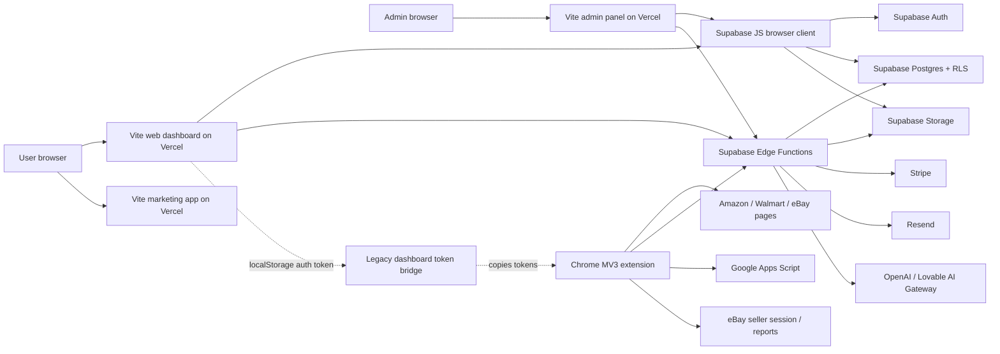
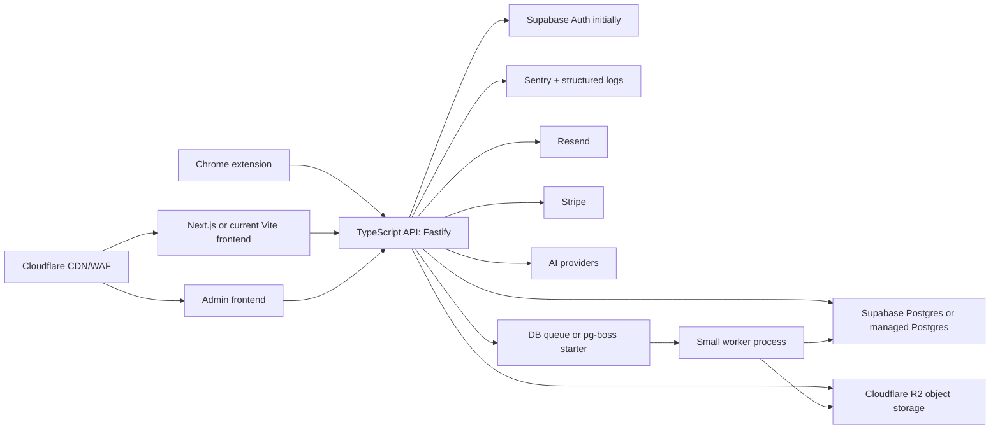
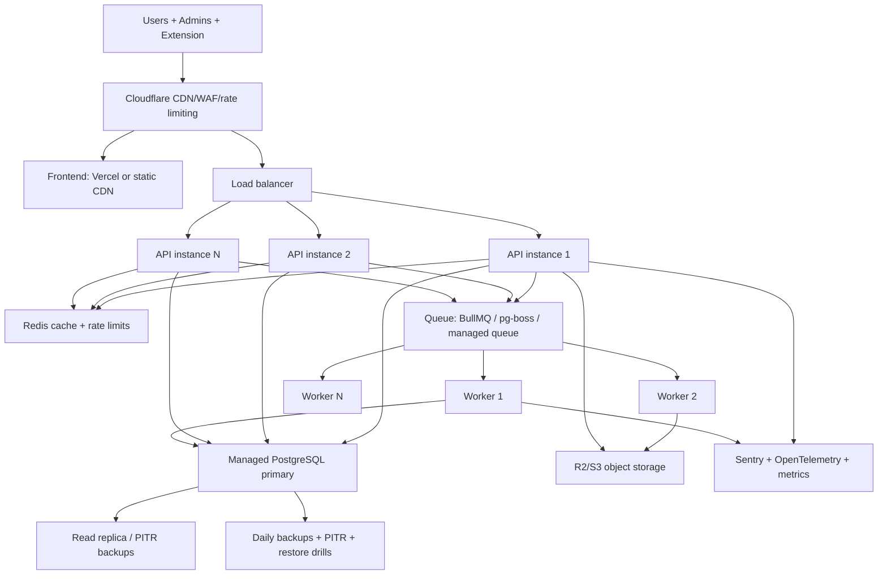
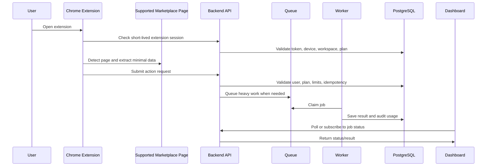
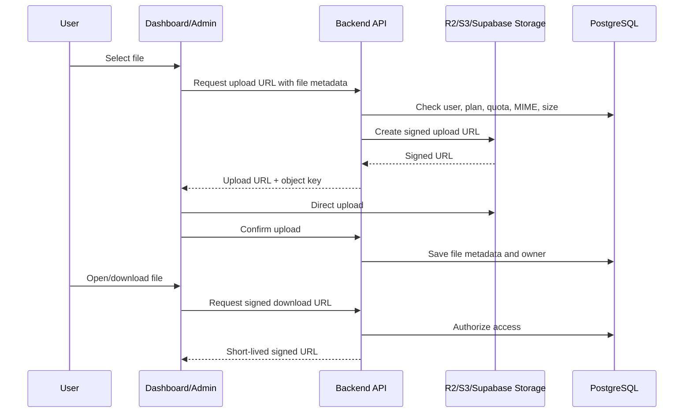
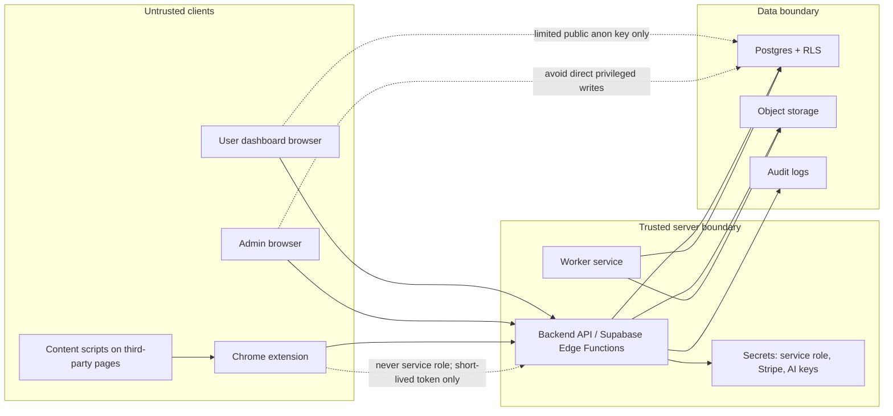

# SellerSuit World-Class SaaS Architecture Audit

Date: 2026-06-12

Scope: repository-level architecture, frontend, browser extension, admin panel, Supabase usage, Vercel usage, database, auth, storage, billing, jobs, security, cost, DevOps, maintainability, and scaling path from current testing stack to 1,000 and 10,000+ users.

This report is based on actual code inspection in this repository plus current official platform documentation for cost and runtime constraints. It does not include a live Supabase database advisor run, production traffic traces, or a production Vercel/Supabase dashboard inspection.

## Executive Summary

### Current Status

SellerSuit is currently a Vite/React monorepo with three browser apps, a Chrome MV3 extension, Supabase Auth/Postgres/Storage/Edge Functions, Stripe billing functions, Resend email, AI gateway integrations, and Vercel static hosting. It is not a Next.js application today, and it does not have a standalone backend API service. The backend boundary is split between Supabase Edge Functions and direct browser access to Supabase tables/RPCs.

Current testing status: good enough for controlled beta/testing. The codebase has meaningful hardening already: RLS migrations, admin Edge Functions, Stripe signature verification, origin validation on checkout, DB-backed rate limiting, internal-secret worker endpoints, extension session tables, static security checks, and extension unit tests.

Production-ready today: no. The system has several high-risk seams that should be fixed before paid production traffic: direct admin writes from the browser, legacy extension token bridging enabled by default, weak/no CSP headers, inconsistent CORS, public generated HTML handling, incomplete queue/worker architecture, and lint debt.

1K-user ready today: not safely. It can probably serve light 1K traffic if usage is low and users are trusted, but it is not ready for a smooth 1K-user SaaS launch until Phase 0 and Phase 1 below are done.

10K-user ready today: no. The current architecture lacks a dedicated backend API, real worker fleet, Redis/queue layer, centralized observability, signed object storage strategy for user files, and stronger abuse/cost controls.

### Biggest Problems

| Problem | Evidence | Severity |
|---|---|---|
| Admin workflows still update privileged tables directly from the SPA | `apps/admin/src/pages/AdminUsers.tsx:312`, `386`, `486`, `556`, `629` update `profiles`, `user_plans`, `credit_transactions`, and `audit_logs` directly | Critical |
| Extension legacy auth copies Supabase dashboard access/refresh tokens into extension storage | `apps/extension/content_scripts/bridge.js:47`, `93`, `95`, `97`; legacy fallback enabled at `apps/extension/common/config.js:101-103`; stale legacy token still accepted at `apps/extension/common/auth-helper.js:169-176` | Critical |
| AI image editing is authenticated and rate-limited but not feature-entitled or usage-charged | `supabase/functions/ai-image-edit/index.ts:18-35`, `51-82`; no `requireFeatureEntitlement` call | High |
| Generated HTML is returned and rendered into extension DOM without a clear sanitization boundary | HTML assembled in `supabase/functions/generate-description/index.ts:336-377`; extension renders with `innerHTML` at `apps/extension/common/description-generator.js:352-356`, `apps/extension/content_scripts/amazon_injector.js:2805-2808`, `apps/extension/content_scripts/walmart_injector.js:2062-2063` | High |
| Vercel config is static SPA fallback only and has no security headers/CSP | `vercel.json:2-7`, `apps/web/vercel.json:2-6`, `apps/admin/vercel.json:2-6` | High |
| TypeScript and lint posture is weak | `tsconfig.base.json:14-20`; `npm run lint` fails with 422 errors and 36 warnings | Medium |
| The queue is a DB claim-table starter, not a production worker system | `supabase/functions/queue-worker/index.ts:40-76`; `background_jobs` table at `supabase/migrations/20260604094811_audit_remediation_p1.sql:25-58` | Medium |
| Public storage buckets are fine for marketing/admin content but not for user-private files | `supabase/migrations/20260521001_create_store_designs.sql:335-397`, `20260126204006...sql:150-194` | Medium |

### Biggest Opportunities

| Opportunity | Why it matters |
|---|---|
| Keep Supabase Postgres/Auth for launch, but move all privileged business operations behind server APIs | Lowest rewrite cost with a stronger trust boundary |
| Promote the newer extension pairing/session-token foundation and remove legacy token sync | Big security win without changing the entire extension product |
| Add Cloudflare R2/S3-style signed upload/download workflow before user file growth | Prevents storage/bandwidth bill shock and cross-user access bugs |
| Add a Fastify TypeScript API and worker service in phases | Gives full control, lower long-term compute cost, and cleaner APIs |
| Turn existing static security scripts into CI gates and fix lint debt by module | The repo already has the start of a security program |

### Final CTO Recommendation

Do not rewrite everything now. Keep Vercel for static frontends and keep Supabase Postgres/Auth/Edge Functions for the 1K launch, but immediately harden trust boundaries: retire legacy extension token sync, move admin writes and credit/plan changes into server-only APIs, enforce CSP/security headers, sanitize generated HTML, and charge/limit AI image edits. For serious growth, add a TypeScript Fastify API plus worker service, Redis/BullMQ or pg-boss, Cloudflare R2 object storage, structured observability, and a stricter database migration/testing workflow. For 10K+, keep PostgreSQL but use managed Postgres with backups/PITR, run multiple API/worker instances behind Cloudflare/WAF, and keep Supabase only where it remains cost-effective.

## Verification Results

| Check | Result | Notes |
|---|---:|---|
| `npm run security:static` | Pass | All custom static security checks pass |
| `npm run typecheck` | Pass | Marketing, web, and admin typecheck pass |
| `npm run lint` | Fail | 458 total findings: 422 errors, 36 warnings |
| `npm audit --audit-level=moderate` | Pass | 0 vulnerabilities reported |
| `npm --prefix apps/extension test` | Pass | 215 tests, 61 suites, 0 failures |

Important interpretation: typecheck passing is useful, but `tsconfig.base.json:14-20` disables strictness, `strictNullChecks`, `noImplicitAny`, unused checks, fallthrough checks, and allows JS. The lint failure is the better signal for engineering debt.

## Current Architecture Summary

### Current Stack

| Layer | Current Implementation | Evidence |
|---|---|---|
| Web dashboard | Vite React SPA | `apps/web/package.json:6-10`, `apps/web/src/App.tsx` |
| Admin panel | Vite React SPA | `apps/admin/package.json:6-10`, `apps/admin/src/App.tsx` |
| Marketing app | Vite React SPA | `apps/marketing/package.json`, `apps/marketing/src/App.tsx` |
| Browser extension | Chrome Manifest V3 | `apps/extension/manifest.json:2`, `apps/web/public/chrome_extension/manifest.json:2` |
| Hosting | Vercel static SPA fallback | `vercel.json:2-7`, app-level `vercel.json` files |
| Auth | Supabase Auth plus custom OTP Edge Function | `packages/auth/src/hooks/useAuth.tsx:228-327`, `supabase/functions/auth-otp/index.ts` |
| Database | Supabase Postgres with RLS | base RLS in `supabase/migrations/20251226021050...sql:969-1065` |
| Backend/API | Supabase Edge Functions plus direct Supabase browser access | `supabase/functions/*`, `packages/api-client/src/supabase/client.ts:21-24` |
| Storage | Supabase Storage public buckets for content images/templates | `supabase/migrations/20260521001_create_store_designs.sql:335-397` |
| Billing | Stripe checkout, customer portal, webhook | `supabase/functions/create-checkout/index.ts`, `supabase/functions/stripe-webhook/index.ts` |
| Email | Resend from Edge Functions | `supabase/functions/auth-otp/index.ts:119-163` |
| Jobs | DB claim table and extension-local queues | `supabase/functions/queue-worker/index.ts:40-76`, `apps/extension/background/listing-runner.js:4-17` |
| Observability | Console logs, audit logs, extension logs | no centralized Sentry/OpenTelemetry config found |

## Diagram 1: Current Architecture



## Diagram 2: Recommended 1K User Architecture

The prompt asked for a Next.js 1K diagram. The practical recommendation is: do not block launch on a frontend rewrite. Either keep the current Vite SPAs or consolidate to Next.js later. The critical launch change is the backend trust boundary.



## Diagram 3: Recommended 10K+ User Architecture



## Diagram 4: Extension Workflow



## Diagram 5: File Storage Workflow



## Diagram 6: Security Boundary Diagram



## Important File Inventory

| Path | What it does | Good | Risk / change |
|---|---|---|---|
| `package.json:6-27` | Monorepo workspaces and scripts | Has typecheck, lint, security, build scripts | Add these to CI and block merges |
| `tsconfig.base.json:14-20` | Base TS config | Shared config exists | Enable strictness gradually |
| `eslint.config.js:8`, `20-25` | Root lint config | Modern ESLint 9 | Ignores `supabase`, disables some rules, lint currently fails |
| `vercel.json:2-7` | Root Vercel static output and SPA fallback | Simple frontend deployment | No security headers, cache policy, or API/backend config |
| `packages/api-client/src/supabase/client.ts:5-24` | Supabase browser client | Uses publishable key, dev-only localStorage override | Auth persists in localStorage; all direct DB access depends on perfect RLS |
| `packages/auth/src/hooks/useAuth.tsx:128-271` | Auth/session/role logic | Checks roles and login context | Browser-side role fetch is not a server trust boundary |
| `packages/auth/src/ProtectedRoute.tsx:134-151` | Client route protection | Admin redirect and role gates | Payment-required gate is explicitly disabled |
| `supabase/config.toml:4-115` | Edge Function JWT verification config | Exceptions are documented | Several extension/custom-token endpoints intentionally bypass platform JWT |
| `supabase/functions/_shared/cors.ts:67-73` | Origin-aware CORS helper | Good pattern | Not used consistently everywhere |
| `supabase/functions/_shared/extension-session.ts:540-627` | New extension/legacy auth resolver and entitlement helper | Strong foundation for extension auth | Shared CORS is wildcard; legacy fallback remains |
| `supabase/functions/create-checkout/index.ts:77-286` | Stripe checkout | Origin validation, limited JSON, server-side plan price | Good pattern to copy |
| `supabase/functions/stripe-webhook/index.ts:23-131` | Stripe webhook verification | Signature enforced outside development | Add webhook event idempotency table |
| `supabase/functions/auth-otp/index.ts:82-185` | OTP and login context | Has hashed OTP, per-IP/email rate limits, email hash logs | Public wildcard CORS is tolerable but should be origin-limited |
| `supabase/functions/create-listing/index.ts:4-416` | Extension listing creation | Auth, entitlement, limits, idempotent SKU/ASIN, RPC | Duplicates auth/entitlement logic and uses wildcard CORS |
| `supabase/functions/ai-image-edit/index.ts:18-82` | AI image editing | Auth and rate limits | Missing entitlement, quota, size, content validation, and cost deduction |
| `supabase/functions/queue-worker/index.ts:16-76` | Internal worker claim endpoint | Protected by internal secret | Claims only; no actual job processing/retry/dead-letter handling |
| `apps/admin/src/pages/AdminUsers.tsx:312-653` | Admin user/plan/credit management | Some admin functions used | Critical direct DB writes from browser |
| `apps/extension/common/config.js:18-53`, `101-103` | Extension endpoint/config | Centralized extension config | Hardcoded project/anon values, legacy auth enabled |
| `apps/extension/content_scripts/bridge.js:47-97` | Dashboard-to-extension token bridge | Smooth onboarding | Copies dashboard tokens into extension |
| `apps/extension/background/message-router.js:97-201`, `327-341` | Pairing and legacy token sync | Pairing flow exists | Legacy `SYNC_TOKEN` path still active |
| `apps/extension/common/sync-utils.js:19`, `236-286`, `662-778` | eBay CSV sync | Handles report download and logging | Debug logs on, client-side queue, relies on user eBay session |
| `apps/extension/background/listing-runner.js:4-17`, `492-511` | Bulk listing queue | MV3 alarm-aware recovery | Local extension queue is not a backend job system |

## Supabase Usage Analysis

| Supabase Feature | Current Usage | Problem / Risk | Keep or Replace | Recommended Alternative | Priority |
|---|---|---|---|---|---|
| Auth | Main app auth via Supabase Auth; custom OTP via `auth-otp`; browser client persists session in localStorage | LocalStorage tokens are exposed to XSS; admin role checks in UI are not enough | Keep for 1K | Keep Supabase Auth initially; add server-side RBAC APIs; later evaluate Better Auth if you want full control | P0 |
| Database | Main Postgres database with many RLS policies and migrations | Direct browser access means every policy must be correct; admin direct writes are critical | Keep for 1K | Keep Supabase Postgres, reduce exposed table writes; move business writes to API/RPC | P0 |
| RLS | Enabled on core tables; RLS update hardening added with `WITH CHECK` | Older migrations use `auth.role()` service-role policies; need advisor run and grants audit | Keep | Keep RLS as defense in depth even after own API | P0 |
| Edge Functions | Checkout, auth OTP, admin functions, extension APIs, AI, sync, jobs | Inconsistent CORS and duplicated auth/entitlement logic | Keep short term | Consolidate shared middleware; gradually migrate to Fastify API | P1 |
| Storage | Public content buckets for store/product images; signed template URL function | Public buckets are inappropriate for private user files | Keep for public assets | R2/S3 signed URLs for user files; metadata in Postgres | P1 |
| Realtime | Store design/page settings added to realtime publication | Realtime can become noisy and costly if overused | Keep selectively | Use for admin/content updates only; avoid high-volume job progress | P2 |
| Browser table access | Dashboard/admin directly call tables | Admin-level operations exposed to frontend are critical | Replace privileged writes | API endpoints for admin/user/plan/credit/files | P0 |
| Extension API calls | Extension calls Edge Functions and some Supabase REST helpers | Public anon token is fine, but legacy JWT fallback is weak | Keep API, replace auth mode | Short-lived opaque extension tokens only | P0 |
| Admin operations | Mix of Edge Functions and direct Supabase table writes | Split trust boundary | Replace direct writes | Admin module in API; every action logged | P0 |

Recommendation: keep Supabase for 1K because it gives you auth, Postgres, RLS, Edge Functions, and operational speed at low cost. Do not stay Supabase-only for 10K if extension automation and AI usage become high-volume. Move expensive, privileged, and long-running workflows into your own API/worker stack.

## Vercel Usage Analysis

| Vercel Usage | Good For | Risk | 1K User Recommendation | 10K+ Recommendation |
|---|---|---|---|---|
| Static SPA hosting | Marketing, dashboard, admin bundles | No server-side protection for admin routes; app relies on client auth + RLS/API | Keep Vercel for frontend if pricing is acceptable | Keep static frontend on Vercel or Cloudflare Pages |
| API routes | None found | Backend is not on Vercel | Do not add long-running API work to Vercel | Use dedicated API containers |
| Background jobs | None on Vercel | Vercel is not your worker platform | Do not run jobs here | Dedicated worker service |
| File uploads | Not routed through Vercel | Good, avoids function limits | Use signed object-storage uploads | Direct-to-R2/S3 signed uploads |
| Environment variables | Examples exist; real `.env` files untracked | Need preview/prod separation and secret rotation | Add env checklist and preview restrictions | Central secret manager / platform envs |
| Builds | Vite build on Vercel | Monorepo build cost can grow | Cache dependencies; separate projects | Consider static CDN or Vercel Pro spend caps |
| Preview deployments | Likely available by Vercel defaults | Preview admin URLs can hit real Supabase if envs misconfigured | Use preview Supabase project and preview admin restrictions | Separate staging/prod projects |
| Admin routes | Client-protected only | Anyone can load admin bundle; server must enforce all auth | Accept only if all admin actions server-side | Server-side admin API + WAF/2FA |

Vercel is fine for testing and 1K static frontend traffic. It is not currently your backend. For 10K+, Vercel can still host static frontends, but API/worker/background processing should live in containers or managed compute.

## Backend Architecture Recommendation

### Backend Options

| Backend Option | Pros | Cons | Cost | Scalability | Maintainability | Recommended? |
|---|---|---|---|---|---|---|
| Supabase-only backend | Fastest, low ops, built-in auth/RLS | Hard to enforce all business logic cleanly; Edge Function limits; direct DB temptation | Low at 1K | Medium | Medium | Short term only |
| Next.js API routes | Good if frontend becomes Next.js; simple deployment | Not ideal for extension-heavy jobs; serverless/runtime limits; mixes UI and backend | Medium | Medium | Medium | No for core backend |
| NestJS | Strong structure, DI, enterprise patterns | More boilerplate and learning curve | Low to medium on VPS/container | High | High for larger team | Good if team grows |
| Fastify | Fast, TypeScript-friendly, simple, plugin ecosystem | Less opinionated than Nest | Low | High | High if modules are disciplined | Yes |
| Express | Familiar and flexible | Less modern, easier to make messy | Low | Medium | Medium | Only if team already prefers it |
| Hono | Great edge/serverless ergonomics | Smaller enterprise ecosystem for full backend | Low | High | Medium | Good for edge APIs, not main choice |
| Hybrid Supabase + own backend | Low rewrite risk, stronger trust boundary | Two systems to operate during migration | Low to medium | High | High with clear ownership | Yes |

Final backend choice: Hybrid now, Fastify API plus worker next. Keep Supabase Auth/Postgres/Storage/Edge Functions where they are already strong, but move privileged and costly workflows to a modular Fastify API. If the team grows and wants stronger conventions, NestJS is a reasonable later switch, but it is not necessary to reach 1K or 10K.

### Recommended Backend Monorepo Structure

```text
apps/
  web/                 # Current dashboard or future Next.js app
  admin/               # Admin UI
  marketing/           # Marketing site
  api/                 # Fastify API
  worker/              # Queue workers
  extension/           # Canonical extension source
packages/
  database/            # Drizzle/Prisma schema, migrations, SQL helpers
  shared/              # Shared types, zod schemas, DTOs
  config/              # Typed env/config
  logger/              # Structured logger
  auth/                # Auth/RBAC helpers
  api-client/          # Browser API client, not direct DB client
  ui/                  # Shared UI components
```

Backend modules:

| Module | Responsibilities |
|---|---|
| Auth | Verify Supabase JWT or future auth sessions, extension sessions, device revocation |
| Users | Profiles, onboarding, user status |
| Admin | User management, role management, plan overrides, audit log writes |
| Extension | Pairing, session tokens, page actions, version compatibility, throttling |
| Billing | Stripe checkout, portal, webhooks, subscription sync, idempotency |
| Storage | Signed upload/download, quotas, file metadata, cleanup |
| Usage | Usage records, soft limits, fair-use thresholds, credits |
| Rate Limit | User/IP/device/plan-based limits, Redis-backed at scale |
| Audit Log | Admin actions, sensitive reads, support notes |
| Notification | Resend/email, user notices, inventory alerts |
| Queue/Jobs | Background jobs, retries, dead letters, worker status |
| Settings | Feature flags, AI settings, prompts, system config |

## Database Report

### Current Database Strengths

| Strength | Evidence |
|---|---|
| Core tables have RLS enabled | `supabase/migrations/20251226021050...sql:969-1065` |
| RLS update policies were hardened with `WITH CHECK` | `supabase/migrations/20260604094811_audit_remediation_p1.sql:60-99` |
| Atomic RPCs use row locks for listing/order usage | `supabase/migrations/20260604094811_audit_remediation_p1.sql:107-190`, `289-413` |
| Privileged functions had execute grants revoked | `supabase/migrations/20260604094811_audit_remediation_p1.sql:457-523` |
| Extension workspace/device/session foundation exists | `supabase/migrations/20260522123000_extension_device_sessions_foundation.sql` |
| Bulk job items have owner RLS and indexes | `supabase/migrations/20260612090000_create_bulk_job_items.sql` |
| Rate limit table has unique bucket/subject/window index | `supabase/migrations/20260604102100_phase1_rate_limits_and_otp_hardening.sql:1-18` |

### Database Risks

| Risk | Evidence | Fix |
|---|---|---|
| Direct browser writes rely too heavily on RLS | `AdminUsers.tsx:312-653`, `BulkLister.tsx:163-462` | Move writes to server APIs/RPCs with explicit authorization |
| Usage deduction is partly non-atomic in shared middleware | `supabase/functions/_shared/plan-middleware.ts:407-528` | Use atomic SQL functions for every quota/credit mutation |
| Stripe webhook lacks an obvious event-id idempotency table | `stripe-webhook/index.ts:131-535` processes `event.id` but no insert guard found | Add `stripe_events(event_id primary key, processed_at, status)` |
| Old service-role policies use `auth.role() = 'service_role'` | `20260121201354...sql:8`, `15`; `20260122001954...sql:38`, `69` | Remove/replace; service role bypasses RLS already |
| Exact-count dashboard queries can become expensive | `apps/admin/src/pages/AdminDashboard.tsx:140-144`, `apps/web/src/pages/dashboard/Dashboard.tsx:207-238` | Precompute metrics or use materialized summaries |

### Required Tables for a World-Class SaaS

You already have many of these, but the model should be normalized and owned by server modules.

| Table | Current status | Recommendation |
|---|---|---|
| `profiles` | Exists | Keep; do not store auth decisions only in user metadata |
| `user_roles` | Exists, hardened | Keep; add permission matrix if roles expand |
| `plans` | Exists | Keep; make plan limits explicit and versioned |
| `user_plans` / `subscriptions` | Both patterns exist | Consolidate into one source of truth plus Stripe subscription mirror |
| `usage_logs` | Exists | Keep for audit; add daily aggregate usage records |
| `usage_records` | Missing or not central | Add immutable usage ledger keyed by user, workspace, feature, idempotency key |
| `feature_entitlements` | Exists in extension foundation | Extend to all paid features |
| `feature_flags` / `app_feature_flags` | Exists | Move writes to admin API |
| `audit_logs` | Exists | Require every admin/support/system action |
| `support_notes` | Exists in extension foundation | Use for support workflow |
| `background_jobs` | Exists | Either complete with pg-boss semantics or replace with BullMQ/managed queue |
| `files` / `file_objects` | Missing as central table | Add for storage metadata, owner, size, checksum, retention |
| `stripe_events` | Missing | Add for webhook idempotency |
| `api_keys` / `extension_devices` | Extension devices exist | Add user API keys only if external public API is planned |

### Required Indexes

Verify with `EXPLAIN (ANALYZE, BUFFERS)` before adding blindly.

| Area | Index |
|---|---|
| Dashboard listings | `listings(user_id, status, created_at desc)` |
| Listing idempotency | Unique or partial unique on `listings(user_id, sku)` and `listings(user_id, ebay_item_id)` where not null |
| eBay orders | `ebay_orders(user_id, order_date desc)`, `ebay_orders(user_id, order_status, order_date desc)`, unique source order id per user |
| Usage | `usage_logs(user_id, created_at desc)`, `usage_records(user_id, feature_key, period_start)` |
| Audit | `audit_logs(user_id, created_at desc)`, `audit_logs(action, created_at desc)` |
| Admin search | Lowercase/email search should use an auth mirror or admin RPC, not broad table scans |
| Jobs | Existing `idx_background_jobs_claim` is good; add locked/worker heartbeat columns if kept |
| Extension sessions | Token hashes/device/session lookups must be unique and indexed |
| Rate limits | Existing unique `(bucket, subject_hash, window_start)` is good; add scheduled cleanup |

### Database Options

| Database Option | Monthly Cost Level | Control | Maintenance Burden | Backup Safety | Scaling | Recommendation |
|---|---|---:|---:|---:|---:|---|
| Supabase Postgres | Low to medium | Medium | Low | Good on paid plans | Good for 1K, medium for 10K | Best for launch |
| Neon | Low to medium | Medium | Low | Good | Good for serverless Postgres | Good if leaving Supabase BaaS |
| Railway Postgres | Low usage-based | Medium | Medium | Medium | Medium | Good for dev/staging, cautious for prod |
| DigitalOcean Managed PostgreSQL | Low predictable | Medium | Low | Good | Medium to high | Best balanced low-cost managed DB |
| AWS RDS | Medium to high | High | Medium | Excellent | High | Best enterprise path |
| Self-hosted PostgreSQL on VPS | Lowest | Highest | High | Risky unless backups are excellent | Medium | Only for non-critical or very cost-sensitive launch |
| Docker Postgres via Coolify | Low | High | High | Risky if not disciplined | Medium | Acceptable only with automated offsite backups and restore drills |

Final DB recommendation:

| Goal | Recommendation |
|---|---|
| 1K users | Keep Supabase Postgres paid project; enable backups; run advisors; reduce direct table writes |
| 10K+ users | Managed Postgres with PITR: Supabase paid, DigitalOcean managed, Neon, or RDS depending budget |
| Lowest cost safe setup | Supabase Pro or DigitalOcean managed Postgres plus offsite backup exports |
| Safest setup | AWS RDS or Supabase Team/Enterprise with PITR, support, read replicas if needed |
| Best balanced setup | Supabase Postgres for launch, later DigitalOcean managed/RDS if control/cost requires |

Backup plan:

| Need | Recommendation |
|---|---|
| Frequency | Daily logical backup plus provider PITR for paid production |
| Retention | 7 daily, 4 weekly, 6 monthly for financial/audit tables as business requires |
| Restore drill | Monthly restore into staging; document RTO/RPO |
| Critical tables | `profiles`, `user_roles`, `plans`, `user_plans`, `subscriptions`, `usage_records`, `audit_logs`, `listings`, `ebay_orders`, `extension_*`, `files`, `stripe_events` |
| Failure restore | Freeze writes, restore latest PITR/logical backup to new DB, rotate app env, replay idempotent webhooks/jobs |

## Storage Report

### Current Storage

| Current Use | Evidence | Assessment |
|---|---|---|
| `store-design-images` public bucket | `20260521001_create_store_designs.sql:335-397` | Fine for public marketing/admin design images |
| `product-images` public bucket | `20260126204006...sql:150-194` | Fine for public product images |
| Admin direct upload | `useStoreDesigns.ts:467-492` | Admin-only if storage RLS is perfect; move to signed upload API for consistency |
| Signed template URL | `get-template-url/index.ts:168-191` | Good pattern for private templates |

### Storage Options

| Storage Option | Pros | Cons | Cost | Scalability | CDN Support | Recommended? |
|---|---|---|---|---|---|---|
| Supabase Storage | Integrated with Auth/RLS; easy | Egress/storage can grow with Supabase bill | Low to medium | Good | Built-in CDN for public assets | Keep for current public assets |
| Cloudflare R2 | Low storage cost, no egress fees, S3-compatible | Operation pricing and Cloudflare-specific ops | Low | High | Excellent via Cloudflare | Yes for user files |
| AWS S3 | Mature, enterprise controls | Egress and pricing complexity | Medium to high | Very high | CloudFront | Yes for enterprise |
| Backblaze B2 | Cheap TB storage, CDN partners | Less enterprise-native than AWS | Low | High | Partner CDN | Good alternative |
| DigitalOcean Spaces | Simple $5 baseline, built-in CDN | Fewer advanced controls | Low | Medium | Built-in CDN | Good simple option |
| Local VPS disk | Cheapest | Data loss/scaling/security risk | Lowest | Low | Manual | No for SaaS user files |

Ideal storage workflow:

1. User requests upload from dashboard/admin/extension.
2. Backend validates auth, plan, file count, size, MIME type, extension, and intended object purpose.
3. Backend creates object key and signed upload URL.
4. Browser uploads directly to object storage.
5. Browser confirms upload.
6. Backend stores metadata in `files`.
7. Access uses short-lived signed download URL or public CDN URL only for intentionally public assets.

File naming convention:

```text
users/{user_id}/{yyyy}/{mm}/{file_id}/{original-slug}.{ext}
workspaces/{workspace_id}/templates/{file_id}.{ext}
public/store-designs/{design_id}/{asset_id}.{ext}
```

Rules:

| Rule | Recommendation |
|---|---|
| Max file size | Plan-based; start 10 MB images, 50 MB templates, configurable |
| Allowed MIME | Explicit allowlist; check by server and storage policy |
| Malware scanning | Add for user-uploaded archives/docs before public sharing |
| Retention | Delete orphan temp uploads after 24 hours; deleted-account files after retention window |
| Metadata | Store size, MIME, checksum, owner, visibility, storage provider, object key |
| Backups | Object storage replication only for business-critical templates/user files |

## Authentication and Authorization Report

### Current Auth

| Area | Current Status | Risk |
|---|---|---|
| Signup/login | Supabase Auth via `useAuth`; OTP verification via `auth-otp` | Reasonable |
| OTP | Has hashed codes, rate limits, 15-minute expiry, email-hash logging | Good |
| Login context | `auth-otp` prevents admin accounts from user login and vice versa | Good |
| Session storage | Supabase browser client persists in localStorage | XSS exposure risk |
| Client route protection | `ProtectedRoute` gates admin/super-admin routes | UX only, not security boundary |
| Admin roles | `user_roles` with admin/super_admin/moderator/staff | Good start |
| Extension auth | New pairing/session foundation exists | Legacy dashboard token bridge still enabled |
| Payment gate | Disabled in `ProtectedRoute.tsx:150-151` | Revenue/cost risk |

### Auth Options

| Auth Option | Pros | Cons | Cost | Control | Security | Recommendation |
|---|---|---|---|---|---|---|
| Supabase Auth | Already integrated; RLS-aware; low cost | LocalStorage tokens in SPA; less custom control | Low | Medium | Good if hardened | Keep for 1K |
| Better Auth | Open-source, self-hosted, strong control | Migration work and new auth tables | Low | High | High if implemented well | Consider with own backend |
| Auth.js | Flexible, open-source, framework-friendly | More DIY for password/roles/security posture | Low | High | Medium to high | Good for Next.js, not urgent |
| Clerk | Fast, polished, user management | Vendor cost and lock-in | Low at small scale, can grow | Low | High | Good if speed > control |
| Custom Nest/Fastify auth | Full control | Highest security burden | Low infra, high engineering | Highest | Depends on expertise | Not first choice |

Extension auth safest approach:

| Rule | Implementation |
|---|---|
| No service keys in extension | Already true; keep it that way |
| No dashboard JWT copying | Remove `SYNC_TOKEN` bridge after migration |
| Short-lived access token | Use existing `ssat_` opaque access token pattern |
| Refresh rotation | Store hashed refresh tokens server-side and rotate on refresh |
| Device/session revocation | Use `extension_devices` and `extension_sessions` tables |
| Backend validation | Every request validates user, workspace, device, plan, feature, rate limit |
| Storage assumption | Treat `chrome.storage.local` as recoverable but not highly secret |
| Version checks | Extension bootstrap should enforce min version and feature flags |

Recommended roles:

| Role | Purpose |
|---|---|
| User | Normal paid/free user |
| Pro user | Plan level, not necessarily a role |
| Team owner | Workspace billing and members |
| Team member | Workspace-limited access |
| Support admin | Can view support data, cannot change roles/billing without approval |
| Admin | Operational admin |
| Super admin | Role/billing/destructive authority |
| System worker | Internal service identity for jobs |

Every admin/support action must write to `audit_logs` with actor, target, action, before/after, reason, IP/device/request ID.

## Extension Architecture Report

### What the Extension Currently Does

| Area | Evidence | Assessment |
|---|---|---|
| Manifest V3 | `apps/extension/manifest.json:2` | Good |
| Permissions | `storage`, `scripting`, `tabs`, `alarms`, `sidePanel`, `unlimitedStorage` at `manifest.json:7-13` | Broad, especially `tabs` and `unlimitedStorage` |
| Host permissions | Amazon/Walmart/eBay/SellerSuit/Supabase at `manifest.json:15-41` | Broad but understandable for product automation |
| Content scripts | Supplier/eBay scrapers and bridge | Powerful, must be treated as untrusted |
| Background worker | Message router, bulk runner, alarms | Good MV3 pattern |
| Pairing flow | `message-router.js:97-201` | Good new direction |
| Legacy sync | `message-router.js:327-341` | Must retire |
| eBay order sync | `sync-utils.js:236-286`, `662-778` | Useful but client/session dependent |
| Bulk listing | `listing-runner.js:4-17`, `492-511` | Good local automation, not true backend queue |
| Debug logging | `sync-utils.js:19` | Disable in production |

What the extension should do:

1. Authenticate with short-lived extension tokens only.
2. Detect supported pages and extract the minimum required data.
3. Submit normalized payloads to backend APIs.
4. Let backend validate plan, credits, abuse limits, idempotency, and feature flags.
5. Queue heavy or retryable work server-side.
6. Show status from backend job state.
7. Keep local queues only for browser-only tasks that cannot run server-side due to marketplace sessions.

What the extension should not do:

| Do not | Reason |
|---|---|
| Store service keys | Catastrophic secret exposure |
| Copy dashboard refresh tokens | Broadens token compromise impact |
| Trust client-side plan/role checks | Extension code is user-controlled |
| Render arbitrary generated HTML without sanitization | XSS risk inside extension/dashboard |
| Open arbitrary URLs from page messages | `OPEN_BACKGROUND_TAB` should allowlist URLs |
| Run unlimited AI/storage/API calls | Direct cost risk |

## API Design Report

### Current API Shape

The current API is a set of Supabase Edge Functions with inconsistent response formats and CORS posture. Some functions are strong examples, especially `create-checkout`, while others duplicate auth, return `200` for application errors, or use wildcard CORS.

Recommended API routes:

```text
/api/v1/auth
/api/v1/users
/api/v1/admin
/api/v1/extension
/api/v1/files
/api/v1/jobs
/api/v1/billing
/api/v1/usage
/api/v1/settings
```

Standard success response:

```json
{
  "success": true,
  "data": {},
  "meta": {},
  "error": null
}
```

Standard error response:

```json
{
  "success": false,
  "error": {
    "code": "RATE_LIMITED",
    "message": "Too many requests",
    "details": {}
  }
}
```

API requirements:

| Requirement | Recommendation |
|---|---|
| Validation | Zod schemas shared in `packages/shared` |
| Auth | Central middleware for browser JWT, extension opaque token, internal worker token |
| Authorization | Permission checks per action, not just route role |
| Rate limits | IP + user + device + plan buckets |
| Pagination | Cursor pagination for listings/orders/audit logs |
| Sorting/filtering | Explicit allowlisted fields |
| Idempotency | Idempotency key on listing creation, Stripe webhooks, file confirms, jobs |
| Logging | Request ID, actor ID, workspace ID, action, latency, status |
| Docs | OpenAPI generated from schemas |
| CORS | Allowlist dashboard/admin/extension origins; no wildcard on sensitive endpoints |

## Workflow Report

| Workflow | Current Status | Problem | Recommended Flow | Required Backend Logic | Security / Scaling |
|---|---|---|---|---|---|
| User onboarding | Signup/login via Supabase + OTP; selected plan in localStorage | Payment gate disabled; plan selection can be stale | Signup -> verify email -> create profile/workspace -> checkout/free trial -> extension install | `users`, `workspaces`, `subscriptions`, `usage_records` | Server decides plan, not browser |
| Extension connect | New pairing exists, legacy bridge still active | Legacy token sync is risky | Extension start pairing -> dashboard approve -> redeem opaque token -> bootstrap config | Pairing grants, device/session tables | Short TTL, rotate refresh token |
| Extension action | Extension calls Edge Functions | Mixed auth modes, client-local queues | Extract -> API validate -> job or immediate action -> status | Entitlement, rate limit, idempotency, job state | Per-plan quotas and abuse detection |
| Admin user management | Mixed direct DB writes and admin Edge Functions | Critical trust split | Admin UI -> admin API -> service role -> audit log | Admin module, permission matrix, audit log | Require 2FA for admin |
| File upload | Admin Supabase public upload | Not ready for user-private files | Signed upload -> object storage -> metadata -> signed access | File module, quotas, malware scan | No large files in DB |
| Billing | Checkout and webhook exist | Webhook idempotency missing; payment gate disabled | Plan selection -> checkout -> webhook idempotency -> subscription mirror -> access | Stripe events table, subscription state machine | Grace periods and retry handling |
| Support | Some admin notes/support tables exist | No standard support workflow | User issue -> support lookup -> action -> audit -> notification | Support notes, sensitive reveal, audit | Least privilege |

## Security Report

### Severity Table

| Issue | Severity | File / Area | Risk | Fix | Priority |
|---|---|---|---|---|---|
| Admin direct writes from SPA | Critical | `apps/admin/src/pages/AdminUsers.tsx:312-653` | Admin user/browser compromise or RLS bug can mutate users, plans, credits | Move to server-only admin API; revoke browser write policies where possible | P0 |
| Legacy extension token sync | Critical | `bridge.js:47-97`, `auth-helper.js:169-176`, `config.js:101-103` | Dashboard access/refresh tokens copied into extension storage and stale legacy tokens accepted | Enable new auth, disable legacy fallback, remove bridge token sync | P0 |
| Generated HTML rendered without consistent sanitization | High | `generate-description/index.ts:336-377`, extension `innerHTML` refs | XSS in dashboard/extension/eBay content flow | Server-side HTML sanitizer/allowlist plus client DOMPurify or text rendering | P0 |
| AI image edit lacks entitlement/quota/cost deduction | High | `ai-image-edit/index.ts:18-82` | Cost abuse and privacy leakage | Require feature entitlement, credit deduction, file size/MIME and image host checks | P0 |
| Missing security headers/CSP | High | Vercel configs | XSS blast radius and clickjacking risk | Add CSP, frame-ancestors, HSTS, X-Content-Type-Options, Referrer-Policy | P0 |
| Wildcard CORS on sensitive functions | Medium | admin functions, extension shared CORS | Origin hygiene weak; bearer tokens still protect auth | Use shared allowlist CORS helper | P1 |
| Stripe webhook idempotency | Medium | `stripe-webhook/index.ts:131-535` | Duplicate credit/order transactions on retries | Add `stripe_events` table and transaction guard | P1 |
| Public buckets for future private files | Medium | Storage migrations | Cross-user/file scraping if used for private content | Keep public only for intentional public assets; use signed URLs for user files | P1 |
| Hardcoded public Supabase project/config in extension | Medium | `config.js:18-53`, `editor_core.js:1912-1931` | Rotation/environment coupling | Generate config at build time and fetch remote bootstrap | P2 |
| Verbose logs / raw AI data logs | Medium | `generate-titles/index.ts:97`, `345`; `sync-utils.js:19` | PII/product data leakage | Mask/truncate structured logs; disable debug in prod | P1 |
| Lint failure and conditional hook | Medium | `TurnstileCaptcha.tsx:16-27`, lint output | Hidden runtime bugs and weaker CI | Fix hook order and `any` hot spots | P1 |
| Old `auth.role()` policies | Low | old migrations | Confusing/deprecated policy model | Clean migration or document replacement | P2 |

### Minimum Security for 1K

| Control | Status | Action |
|---|---|---|
| HTTPS | Likely via Vercel/Supabase | Keep |
| RBAC | Partial | Server-side permission matrix |
| Rate limiting | Partial | Extend to all high-cost endpoints |
| Input validation | Partial | Zod on all APIs |
| Private storage | Not central | Add signed storage API |
| Audit logs | Exists | Make mandatory for admin/support/system |
| Admin 2FA | Not found | Add before public launch |
| Backups | Not verified | Enable paid backups/PITR |
| Error monitoring | Not found | Add Sentry |

### Stronger Security for 10K+

Add Cloudflare WAF, bot/rate limiting, IP/device reputation, centralized audit log export, alerting on admin actions, secrets rotation, dependency scanning in CI, regular RLS advisor runs, restore drills, and a pen-test checklist before major launch campaigns.

## Performance and Scalability Report

| Bottleneck | Current Risk | 1K User Fix | 10K+ User Fix | Priority |
|---|---|---|---|---|
| Direct dashboard counts | Exact count queries can become slow | Add indexes and summary tables | Metrics pipeline/materialized views | P1 |
| DB-backed rate limits | Writes on every limited request | Accept for 1K with cleanup | Redis rate limits | P2 |
| Edge Function CPU/runtime | Supabase Edge Functions have memory/CPU/wall-clock constraints | Keep short I/O functions | Dedicated API/worker containers | P1 |
| Extension local queues | Device/browser-dependent | Keep only for browser-session work | Backend job state and worker fleet | P1 |
| AI calls | Cost and latency | Quotas, credits, timeouts | Queue AI work and provider budgets | P0 |
| File storage | Public buckets and no quotas for user files | Signed uploads and quotas | R2/S3 lifecycle policies | P1 |
| Admin table reads | Admin exact counts and broad selects | Pagination and server RPCs | Read replicas/cached aggregates | P1 |
| Lint/type looseness | Runtime bugs hidden | Fix critical lint and enable strict by package | Strict monorepo CI | P1 |

## Cost Optimization Report

### Cost Risks

| Cost Area | Risk | Control |
|---|---|---|
| Supabase Edge Functions | High invocation volume from extension/AI | Per-user/IP/device rate limits and quotas |
| Supabase DB | Rate-limit table writes, exact counts, large logs | Redis later, retention, summary tables |
| Vercel | Build/seat/usage costs | Static-only usage, spend limits, cache builds |
| Storage | Public buckets, file abuse, egress | R2 signed URLs, quotas, lifecycle deletion |
| AI providers | Unmetered image/text generation | Credits, per-plan budgets, abuse alerts |
| Email | OTP/resend abuse | Existing rate limits plus CAPTCHA/Turnstile |
| Logs | Verbose extension/AI logs | Structured sampling and retention |
| Extension automation | Repeated sync/list actions | Job limits, fair use, throttling |

### Architecture Options

| Architecture Option | Monthly Cost | Control | Maintenance | Scaling | Risk | Recommendation |
|---|---|---:|---:|---:|---|---|
| A: Current testing stack, Vercel + Supabase | Low | Medium | Low | Medium | Security/trust split | Good for testing only |
| B: Balanced 1K, Vercel + Supabase + R2 + hardening | Low to medium | Medium | Low | Good | Still Supabase-heavy | Best launch path |
| C: Full-control VPS/Coolify, Docker API/worker/Postgres/Redis/R2 | Low | High | High | Medium | Ops/backups burden | Good only if you can operate it |
| D: 10K+, CDN/WAF + load-balanced API + managed Postgres + Redis + workers + R2/S3 | Medium to high | High | Medium | High | More moving parts | Future target |

How to make users feel "unlimited" safely:

| Marketing Feel | Internal Control |
|---|---|
| Unlimited listings | Soft cap, queue priority, fair-use threshold, manual review |
| Unlimited AI help | Monthly credits, burst limits, downgrade to slower queue after threshold |
| Unlimited sync | Per-store sync cadence, per-day action cap, background queue |
| Unlimited storage | Plan storage quota, compression, lifecycle cleanup, contact support threshold |
| Unlimited support | Support SLA by plan and abuse flags |

## DevOps and Deployment Report

### Current Deployment

| Area | Status | Recommendation |
|---|---|---|
| Frontend deploy | Vercel static SPA | Keep short term |
| Backend deploy | Supabase Edge Functions | Keep short term; consolidate config |
| Env handling | `.env*` ignored except examples; real env untracked | Good; add secret rotation checklist |
| Production guard | `scripts/production-target-guard.mjs` exists | Good; use in CI |
| CI/CD | Scripts exist; CI not verified | Add GitHub Actions/Vercel checks |
| Migrations | SQL migrations in repo | Add migration review and staging apply |
| Rollback | Not standardized | Add frontend rollback, function rollback, DB migration rollback plan |
| Monitoring | Not centralized | Add Sentry, uptime, log drains |
| Backups | Not verified | Enable and test restore |

### Environment Variable Checklist

| Variable Class | Examples | Rule |
|---|---|---|
| Public browser | `VITE_SUPABASE_URL`, `VITE_SUPABASE_PUBLISHABLE_KEY`, Turnstile site key | Safe to expose, but do not hardcode per environment |
| Server secrets | `SUPABASE_SERVICE_ROLE_KEY`, Stripe secret, webhook secret, Resend, AI keys | Never in browser/extension; rotate regularly |
| Internal secrets | `INTERNAL_FUNCTION_SECRET` | Long random value, rotate, restrict usage |
| URLs/origins | web/admin/marketing URLs | Explicit per environment; no preview hitting prod DB unless intended |

### Deployment Checklist

1. Run `npm run security:static`, `npm run typecheck`, `npm audit`.
2. Fix or explicitly baseline lint before launch.
3. Apply migrations to staging first.
4. Run Supabase RLS/performance advisors.
5. Deploy Edge Functions with prod secrets.
6. Deploy frontend with security headers.
7. Smoke test signup, checkout, extension pairing, listing, order sync, admin role change.
8. Verify Stripe webhook idempotency.
9. Confirm backup and restore plan.
10. Set usage/cost alerts.

### Rollback Checklist

| Layer | Rollback |
|---|---|
| Frontend | Vercel previous deployment |
| Edge Function | Redeploy previous function version or use Supabase CLI release artifact |
| Database | Prefer backward-compatible migrations; if destructive, restore or forward-fix |
| Extension | Chrome Web Store staged rollout; keep server compatibility for old versions |
| Billing | Replay Stripe webhooks idempotently after rollback |

## Maintainability Report

| Maintainability Issue | Current Problem | Recommendation | Priority |
|---|---|---|---|
| TypeScript strictness disabled | `tsconfig.base.json:14-20` | Enable strict per package, starting shared/backend code | P1 |
| ESLint failing | 422 errors, 36 warnings | Fix high-risk rules first: hooks, `any` in API/admin flows | P1 |
| Direct DB in UI | Business logic mixed with UI | Replace with typed API client and server modules | P0 |
| Duplicated extension bundles | `apps/extension` and `apps/web/public/chrome_extension` | Make `apps/extension` canonical and generate public bundle | P1 |
| Hardcoded env/project values | Extension config and dashboard connect URLs | Build-time env injection and remote config | P1 |
| Edge Function duplication | Auth/rate/entitlement patterns repeated | Shared middleware or own API modules | P1 |
| Mixed response formats | Some functions return 200 on errors | Standard API envelope and status codes | P2 |
| Missing shared schemas | Zod exists but not central | `packages/shared/schemas` for all API payloads | P1 |
| Test coverage uneven | Extension has strong unit tests; API/admin less clear | Add API integration and RLS tests | P1 |

Testing strategy:

| Test Type | Scope |
|---|---|
| Unit | Pricing, SKU, parsing, validation, plan limits |
| Integration | Edge/API functions with local Supabase |
| RLS tests | Authenticated user cannot cross tenant/user rows |
| API tests | Admin, billing, extension, files, jobs |
| Extension workflow | Pairing, token refresh, supported page actions |
| E2E | Signup -> checkout -> extension connect -> first listing/sync |
| Load tests | k6 for auth, extension action, dashboard APIs |

## Observability and Monitoring Report

### Current Logging

| Area | Current | Risk |
|---|---|---|
| Edge Functions | Console logs | Not centralized; some raw payload logs |
| Admin actions | `audit_logs` writes in several places | Direct browser writes can be bypassed/inconsistent |
| Extension errors | Extension local logs and activity functions | Debug enabled in sync utils |
| Jobs | `background_jobs` table exists | No worker metrics dashboard |
| Payments | Webhook logs | Need idempotency and alerting |

1K monitoring:

| Need | Tool |
|---|---|
| Frontend/Edge errors | Sentry |
| Uptime | Better Stack/UptimeRobot/Healthchecks |
| API logs | Structured JSON logs with request ID |
| DB health | Supabase dashboard/advisors and slow query inspection |
| Backup alerts | Provider backup success notifications |
| Cost alerts | Supabase, Vercel, Cloudflare, AI provider budgets |

10K monitoring:

| Need | Tooling |
|---|---|
| Traces | OpenTelemetry |
| Metrics | Prometheus/Grafana or managed APM |
| Logs | Logtail/Datadog/Axiom/ELK |
| Queue | Bull Board/pg-boss dashboard/custom worker metrics |
| Security | WAF events, admin action alerts, anomaly detection |

Recommended dashboard metrics:

| Metric |
|---|
| Active users daily/monthly |
| Extension active devices |
| API requests per minute |
| Error rate by endpoint |
| P95/P99 response time |
| Queue length and oldest job age |
| Failed jobs and retry count |
| Storage GB by plan/user |
| Database size and slow queries |
| Signup to first extension action conversion |
| Payment status and failed renewals |
| Suspicious users/IPs/devices |
| Admin actions by actor |

## Admin Panel Report

| Admin Feature | Current Status | Needed for 1K | Needed for 10K+ | Priority |
|---|---|---|---|---|
| Admin login | Exists via `AdminLogin.tsx` and roles | Server-side RBAC | 2FA, IP/device alerts | P0 |
| User list | Exists | Server-side pagination/search | Advanced filters/export | P1 |
| Role management | Function exists | Remove browser direct role/table writes | Permission matrix | P0 |
| Plan management | Exists but direct writes in places | Server API only | Subscription state machine | P0 |
| Credit adjustments | Server function exists and direct path exists | Use only `admin-adjust-credits` style server path | Approval workflow for high amounts | P0 |
| Audit logs | Exists | Mandatory for every action | Immutable export/retention | P0 |
| Extension devices | Exists via extension admin functions | Device revoke/details | Fleet/version health | P1 |
| Feature flags | Exists | Server API only | Targeting/rollout controls | P1 |
| Job monitor | Limited | Show background jobs | Queue dashboard | P1 |
| Storage usage | Not central | Per-user usage | Quotas/cleanup/admin actions | P1 |
| System health | Partial dashboard metrics | Uptime/API/DB/payment status | Full ops console | P2 |
| Dangerous confirmations | Some UI patterns, not verified everywhere | Confirm/destructive reason | Approval workflow | P1 |

## SaaS Feature Flag and Plan System

Current plan/usage foundation exists in `plans`, `user_plans`, `profiles.credits`, `usage_logs`, `feature_entitlements`, and extension feature flags. The plan gate is incomplete because `ProtectedRoute.tsx:150-151` disables payment-required blocking, and some high-cost functions like AI image editing do not deduct credits.

Recommended plan-control tables:

| Table | Purpose |
|---|---|
| `plans` | Public plan definitions |
| `plan_limits` | Versioned limits by feature |
| `subscriptions` | Stripe/customer subscription mirror |
| `usage_records` | Immutable usage ledger |
| `usage_rollups_daily` | Fast dashboard/admin metrics |
| `feature_flags` | Operational feature toggles |
| `feature_entitlements` | Plan/workspace/user feature access |
| `plan_overrides` | Admin-granted override with expiry/reason |

Example limits:

| Limit |
|---|
| Extension actions per day |
| AI title generations per month |
| AI descriptions per month |
| AI image edits per month |
| File uploads per month |
| Storage GB |
| Active listings |
| Background jobs per day |
| Team members |
| Exports per month |
| Sync frequency |

## Recommended Final Architecture

| Component | Current | 1K Recommendation | 10K+ Recommendation | Why |
|---|---|---|---|---|
| Frontend | Vite SPAs on Vercel | Keep Vite or move to Next.js only if useful | Static/CDN frontend, optionally Next.js | Frontend is not the bottleneck |
| Backend | Supabase Edge Functions + direct DB | Supabase + Fastify API for privileged operations | Load-balanced API containers | Clear trust boundary |
| Extension API | Supabase Edge Functions | Opaque extension sessions only | Dedicated extension module + queue | Safer auth and throttling |
| Database | Supabase Postgres | Supabase paid project with backups | Managed Postgres/PITR/read replica if needed | Postgres is correct |
| Storage | Supabase public buckets | R2/S3 signed user files, keep public content buckets | R2/S3 with lifecycle/replication | Cost control |
| Auth | Supabase Auth | Keep, enforce server RBAC | Keep or migrate to Better Auth if control needed | Avoid premature auth rewrite |
| Cache | None central | None or small Redis if needed | Redis | Rate limits, sessions, hot data |
| Queue | DB table + extension local queue | pg-boss/DB queue starter or small Redis queue | BullMQ/managed queue + workers | Reliable background jobs |
| Worker | Supabase internal claim endpoint | Docker worker service | Worker fleet | Long-running/retryable work |
| Admin panel | Vite SPA | Server-only admin mutations | Permission matrix + audit/export | Safety |
| Logging | Console/audit logs | Sentry + structured logs | OTel + central logs/metrics | Operability |
| Deployment | Vercel + Supabase | Vercel + Supabase + API/worker Docker | Cloudflare + LB + containers | Scaling |
| Security | RLS + functions | CSP, admin API, extension token hardening | WAF, alerts, pen-test program | Trust boundaries |
| Backups | Not verified | Paid DB backups + restore drill | PITR + tested DR | Survival |
| CDN | Vercel/Supabase | Cloudflare in front | Cloudflare WAF/CDN | Cost/security |
| Payments | Stripe functions | Add idempotency and state machine | Same plus alerts/reconciliation | Revenue integrity |
| Email | Resend | Keep with rate limits | Keep or add provider failover | Low cost |

### Version 1: Minimum Safe 1K User Architecture

| Component | Choice |
|---|---|
| Frontend | Current Vite SPAs on Vercel |
| Backend | Supabase Edge Functions, but privileged flows server-only |
| Database | Supabase Postgres paid project |
| Storage | Supabase public assets + R2 for private/user files |
| Auth | Supabase Auth |
| Extension API | Supabase Edge Functions with opaque extension tokens |
| Admin panel | Current admin UI, but all mutations through admin functions |
| Monitoring | Sentry, uptime monitor, Supabase alerts |
| Backups | Daily + PITR if available |
| Deployment | Vercel + Supabase + Cloudflare DNS/WAF |

### Version 2: Balanced Cost + Control Architecture

| Component | Choice |
|---|---|
| Frontend | Current Vite or Next.js if consolidating |
| Backend | Fastify TypeScript API in Docker |
| Database | Supabase Postgres or DigitalOcean managed Postgres |
| Storage | Cloudflare R2 |
| Cache | Redis only when needed |
| Worker | Docker worker using pg-boss or BullMQ |
| Deployment | Coolify/VPS or Railway/Fly/Render for API/worker |
| Monitoring | Sentry + structured logs + uptime |

### Version 3: 10K+ Scalable Architecture

| Component | Choice |
|---|---|
| CDN/WAF | Cloudflare |
| Frontend | Static Vercel/Cloudflare Pages or Next.js |
| API | Multiple Fastify/NestJS instances behind load balancer |
| Workers | Separate worker pool |
| Queue | Redis/BullMQ, pg-boss, or managed queue |
| Database | Managed PostgreSQL with PITR and optional read replica |
| Storage | R2/S3 |
| Observability | OpenTelemetry + central logs + metrics + alerts |
| Security | WAF, admin 2FA, permission matrix, secrets rotation |

## Step-by-Step Migration Plan

| Phase | Goal | Tasks | Files Affected | Priority | Difficulty | Result |
|---|---|---|---|---|---|---|
| Phase 0 | Audit and stabilize | Disable legacy extension auth in prod, add CSP headers, fix AI image entitlement, sanitize generated HTML, add Stripe webhook idempotency | `config.js`, `bridge.js`, `ai-image-edit`, `generate-description`, `vercel.json`, `stripe-webhook` | P0 | Medium | Safer beta/launch |
| Phase 1 | Make current stack 1K-ready | Move admin direct writes to Edge Functions, enable payment gate, add Sentry, run Supabase advisors, add backup restore drill | `AdminUsers.tsx`, admin functions, `ProtectedRoute.tsx`, migrations | P0 | Medium | 1K launch candidate |
| Phase 2 | Add own backend | Create `apps/api`, central auth/RBAC, admin module, extension module, usage module | new API app, `packages/shared`, `packages/auth` | P1 | High | Clear backend boundary |
| Phase 3 | Move storage to R2/S3 | Add signed upload/download API, `files` table, quotas, cleanup job | storage module, migrations, admin/web upload hooks | P1 | Medium | Storage cost control |
| Phase 4 | Add queue/worker | Add worker app, job schema, retries, dead letters, job dashboard | `apps/worker`, `background_jobs` or BullMQ | P1 | Medium/high | Reliable heavy work |
| Phase 5 | Prepare for 10K+ | Redis, load-balanced API, read replicas if needed, OTel, cost/security dashboards | infra, API, worker, DB | P2 | High | Scalable production system |

Immediate P0 checklist:

1. Flip `EXTENSION_NEW_AUTH_ENABLED` on and `EXTENSION_LEGACY_FALLBACK_ENABLED` off after migration testing.
2. Remove or gate `SYNC_TOKEN` and dashboard localStorage token bridge.
3. Move `AdminUsers.tsx` direct profile/plan/credit writes into Edge Functions.
4. Add `requireFeatureEntitlement` and credit deduction to `ai-image-edit`.
5. Sanitize generated descriptions server-side and in extension render paths.
6. Add CSP/security headers to all Vercel apps.
7. Add Stripe webhook idempotency table.
8. Re-enable payment-required gating if paid access is intended.

## Risk Scoring

| Area | Score / 10 | Reason | Required Fix |
|---|---:|---|---|
| Architecture | 6.0 | Good monorepo and Supabase foundation, weak trust boundary | Add API boundary |
| Backend | 5.0 | Useful Edge Functions, duplicated/inconsistent patterns | Central backend modules |
| Database | 7.0 | RLS and hardening migrations are strong | Advisor run, direct-write reduction |
| Storage | 5.0 | Public content buckets work, user-file model missing | Signed R2/S3 workflow |
| Security | 5.0 | Some strong controls, several launch blockers | P0 security checklist |
| Extension | 5.0 | Powerful MV3 extension, legacy auth risk | Opaque tokens only |
| Admin panel | 4.5 | Feature-rich, but direct DB writes | Server-only admin actions |
| Scalability | 5.0 | Fine for low beta, not 10K | Queue/worker/API/Redis |
| Cost efficiency | 6.0 | Low current cost, AI/storage abuse risk | Quotas and R2 |
| Maintainability | 4.0 | Lint debt, loose TS, duplicated extension bundle | Strictness and module cleanup |
| Observability | 4.0 | Audit logs exist, no central monitoring | Sentry/logs/metrics |
| Production readiness | 5.0 | Testing signals good, launch blockers remain | Phase 0/1 |

Overall score: 5.4/10

1K-user readiness score today: 5.8/10

1K-user readiness after Phase 0/1: 7.5/10

10K-user readiness today: 3.5/10

Production readiness today: 5.0/10

## Final Stack Recommendation

### Recommended 1K User Stack

| Layer | Choice |
|---|---|
| Frontend | Keep current Vite SPAs on Vercel, or move to Next.js only if you want SSR/consolidation |
| Backend | Supabase Edge Functions plus server-only admin/extension/billing APIs |
| Database | Supabase Postgres paid project |
| Storage | Supabase for existing public assets, Cloudflare R2 for user/private files |
| Auth | Supabase Auth with server-side RBAC and admin 2FA |
| Cache | None initially; add Redis only if rate limits/metrics become hot |
| Queue | DB-backed queue or pg-boss starter for 1K; extension-local only where browser session is required |
| Deployment | Vercel + Supabase + Cloudflare DNS/WAF |
| Monitoring | Sentry, uptime monitor, Supabase alerts, cost alerts |
| Security | CSP, RLS advisor, server-only admin mutations, extension opaque tokens |

### Recommended 10K+ User Stack

| Layer | Choice |
|---|---|
| Frontend | Vercel/Cloudflare static frontend or Next.js |
| Backend | Fastify or NestJS TypeScript API behind load balancer |
| Database | Managed PostgreSQL with PITR, backups, optional read replica |
| Storage | Cloudflare R2 or AWS S3 with signed URLs and lifecycle policies |
| Auth | Supabase Auth if still cost-effective, or Better Auth if you need full control |
| Cache | Redis |
| Queue | BullMQ/Redis, pg-boss, or managed queue |
| Deployment | Cloudflare + container platform/VPS/Kubernetes when justified |
| Monitoring | Sentry + OpenTelemetry + central logs + metrics dashboards |
| Security | WAF, admin 2FA, permission matrix, security alerts, secrets rotation |

## Direct Answers

| Question | Answer |
|---|---|
| Should I stay with Supabase? | Yes for 1K launch, but stop using it as the direct browser backend for privileged writes. |
| Should I keep Vercel? | Yes for static frontends. Do not use Vercel as your heavy job/backend platform. |
| Should I build my own backend? | Yes, in phases. Start with admin/extension/usage APIs, not a full rewrite. |
| Should I use Cloudflare R2/S3 storage? | Yes for user/private/generated files. |
| Should I use PostgreSQL? | Yes. Postgres is the right database. |
| Should I use Redis now or later? | Later. Add Redis when DB-backed rate limits/jobs become hot or when you adopt BullMQ. |
| Should I use Coolify/VPS? | Good for cost/control if you can operate backups/monitoring. For lowest risk, use managed DB plus container API/worker. |
| What should I do first? | Fix P0 security: extension legacy auth, admin direct writes, AI image quotas, CSP, generated HTML sanitization, Stripe idempotency. |
| What should I not do? | Do not rewrite frontend to Next.js before fixing backend trust boundaries. Do not promise true unlimited usage without quotas. Do not store large files in Postgres. |

## Image Generation Prompts

Use these if you want polished visual diagrams in addition to Mermaid.

1. Current architecture: "Create a clean SaaS architecture diagram for SellerSuit showing a Vite dashboard, Vite admin panel, Chrome MV3 extension, Vercel static hosting, Supabase Auth/Postgres/Storage/Edge Functions, Stripe, Resend, AI gateway, Google Apps Script, and marketplace pages. Use trust-boundary colors and label direct Supabase browser access as a risk."
2. 1K architecture: "Create a modern 1K-user SaaS architecture diagram with Cloudflare CDN/WAF, frontend on Vercel or Next.js, TypeScript API, Supabase or managed Postgres, Cloudflare R2, Sentry, Stripe, Resend, Chrome extension, and a small worker queue."
3. 10K architecture: "Create a scalable SaaS architecture diagram with Cloudflare, load-balanced TypeScript API instances, Redis, queue, worker fleet, managed PostgreSQL with backups/read replica, R2/S3 storage, observability, admin panel, and Chrome extension request flow."
4. Extension workflow: "Create a step-by-step browser extension workflow diagram showing login, token check, page detection, data extraction, backend validation, queueing, worker processing, database save, and dashboard status update."
5. Storage workflow: "Create a secure file storage workflow diagram showing signed upload URL generation, direct object storage upload, metadata persistence, authorization, signed download URL, and cleanup/retention."
6. Security boundary: "Create a trust boundary diagram showing untrusted browser dashboard, untrusted Chrome extension/content scripts, trusted backend API, worker, secrets, PostgreSQL, object storage, audit logs, and external APIs."

## External Sources Consulted

- [Supabase pricing](https://supabase.com/pricing)
- [Supabase RLS docs](https://supabase.com/docs/guides/database/postgres/row-level-security)
- [Supabase Edge Function limits](https://supabase.com/docs/guides/functions/limits)
- [Supabase changelog](https://supabase.com/changelog)
- [Vercel pricing](https://vercel.com/pricing)
- [Vercel pricing docs](https://vercel.com/docs/pricing)
- [Vercel Functions limits](https://vercel.com/docs/functions/limitations)
- [Cloudflare R2 pricing](https://developers.cloudflare.com/r2/pricing/)
- [AWS S3 pricing](https://aws.amazon.com/s3/pricing/)
- [DigitalOcean Managed Databases pricing](https://www.digitalocean.com/pricing/managed-databases)
- [DigitalOcean Spaces pricing](https://www.digitalocean.com/pricing/spaces-object-storage)
- [Neon pricing](https://neon.com/pricing)
- [Railway pricing](https://railway.com/pricing)
- [Backblaze B2 pricing](https://www.backblaze.com/cloud-storage/pricing)
- [Supabase Storage bucket docs](https://supabase.com/docs/guides/storage/buckets/fundamentals)
- [Chrome extension storage API docs](https://developer.chrome.com/docs/extensions/reference/api/storage)
- [Chrome Manifest V3 docs](https://developer.chrome.com/docs/extensions/develop/migrate/what-is-mv3)
- [Clerk pricing](https://clerk.com/pricing)
- [Better Auth comparison](https://www.better-auth.com/docs/comparison)
- [Auth.js getting started](https://authjs.dev/getting-started)
