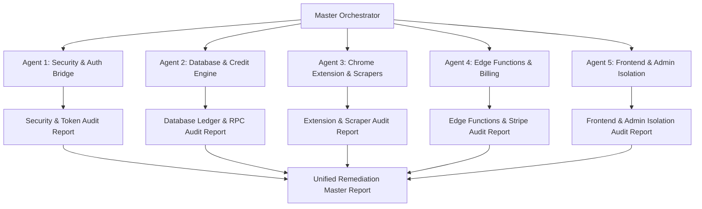

# SellerSuit Multi-Agent Deep SaaS Audit Master Prompt

> **System Designation**: Production-Ready SaaS Architecture & Security Audit Framework  
> **Target Repository**: SellerSuit Monorepo (`d:\eBay Software\2026sellersuit\sb1`)  
> **Primary Scope**: eBay-Only Active SaaS Infrastructure  
> **Execution Mode**: Multi-Agent Parallel Audit (Read-Only & Empirical Verification)

---

## 1. Executive Header & Scope Constraints

### 1.1 Scope Boundary (eBay-Only Rule)
- **Active Marketplace**: **eBay is the ONLY active marketplace.**
- **Shopify Status**: Shopify code, migrations, and schema definitions exist in the repository but are **strictly disabled, hidden, and future scope only**.
- **0% Shopify User-Facing Leak Rule**:
  - Shopify MUST NOT appear anywhere in the user-facing React dashboard (`apps/web`), navigation sidebars, header dropdowns, marketplace integration cards, onboarding screens, settings dialogs, or visible billing plan features.
  - Shopify code MUST be feature-flag gated (`SHOPIFY_ENABLED=false` / `marketplaceScope.shopify.enabled = false`), **never deleted**.
  - No Shopify endpoints or routes should be accessible via active UI navigation.
  - Reports, architecture notes, and documentation generated during or after audit must specify:  
    *"Shopify exists in the repository but is intentionally disabled and is future scope only."*

### 1.2 Credit Deduction Gate Rule (-1 Credit Per Listing)
- **Database Authority**: Every single new eBay listing created (single or variation) MUST decrease **exactly one listing credit** from the user's balance.
- **Enforcement Mechanisms**:
  - `create_listing_with_variations` RPC in PostgreSQL.
  - `trg_enforce_listing_credit_gate` database trigger on listing creation.
  - Automatic balance ledger entry in `credit_transactions` with `amount = -1`.
- **Pre-Check Obligation**: APIs and Edge Functions (`create-listing`, `sync-listing`) MUST verify sufficient credit balance prior to execution and fail gracefully with an actionable error if balance < 1.

### 1.3 Local-First Verification & Quality Pipeline
- Every audit finding and proposed remediation MUST be verified locally before any production deployment artifact is prepared.
- Terminal commands MUST pass cleanly:
  1. `npm run check:local` (env + security + typecheck + lint + build + edge-functions)
  2. `npm test` inside `apps/extension`
  3. `npm run prepare:extension:prod` / `npm run verify:prod`

---

## 2. Multi-Agent Orchestration & Audit Protocol



### Agent Personas & Roles
1. **Agent 1: Security, Auth Bridge & Scope Gate Auditor**  
   Audits postMessage auth bridge, token synchronization (`auth_sync.js`), Chrome storage isolation, Supabase JWT verification in Deno Edge Functions, RLS policies, and Shopify UI leaks.
2. **Agent 2: Database Schema, RPC & Credit Engine Auditor**  
   Audits PostgreSQL migrations, `create_listing_with_variations` RPC, `trg_enforce_listing_credit_gate` trigger, credit transaction ledger, race conditions, and indexing strategies.
3. **Agent 3: Chrome Extension, Scrapers & eBay Payload Auditor**  
   Audits Manifest V3 extension, Amazon/Walmart scrapers, CAPTCHA error propagation, 80-character eBay title enforcement (`_enforceEbayTitle()`), `UniversalProduct` contract, and build sync integrity (`apps/extension/dist` vs `src`).
4. **Agent 4: Edge Functions, Queue Worker & Billing Auditor**  
   Audits Deno Edge Functions (`supabase/functions/`), Stripe subscription flow (`create-checkout`, `customer-portal`, `stripe-webhook`, `check-subscription-v2`), CORS headers, error handling, and `queue-worker` retry/dead-letter queues.
5. **Agent 5: Frontend & Admin Component Auditor**  
   Audits React SPA hygiene (`apps/web`), protected route guards, admin panel separation (`apps/admin`), `vercel.json` rewrites, error boundaries, and design system compliance.

---

## 3. Deep Audit Checklists & Code Targets

### 3.1 Agent 1: Security, Auth Bridge & Scope Gate Auditor

#### Key Focus Areas & Target Files
- `apps/web/src/components/dashboard/DashboardLayout.tsx`
- `apps/web/src/components/dashboard/DashboardSidebar.tsx`
- `apps/extension/src/content_scripts/auth_sync.js`
- `apps/extension/src/background/background.js`
- `supabase/functions/auth-status/index.ts`
- `packages/auth/src/ProtectedRoute.tsx`
- `packages/config/src/navigation.ts`

#### Audit Checklist
- [ ] **Auth Token Bridge Security**:
  - Inspect `DashboardLayout.tsx` for `window.postMessage({ type: 'REFRESH_EXTENSION_TOKEN' }, targetOrigin)`. Verify targetOrigin is explicitly scoped to the web origin (no wildcard `'*'`).
  - Verify `auth_sync.js` verifies message origin before relaying tokens to extension background via `chrome.runtime.sendMessage`.
  - Verify `background.js` handles token storage in `chrome.storage.local` securely without logging plain text JWT secrets.
- [ ] **Server-Side Token Verification**:
  - Verify `supabase/functions/auth-status/index.ts` validates incoming JWT token headers using Supabase Secret key before unlocking extension capabilities.
- [ ] **Row Level Security (RLS) Audit**:
  - Check RLS on user-specific tables (`listings`, `credit_transactions`, `user_profiles`, `orders`). Ensure `auth.uid() = user_id` is strictly enforced for SELECT, INSERT, UPDATE, and DELETE policies.
- [ ] **0% Shopify User Leak Enforcement**:
  - Audit `DashboardSidebar.tsx`, `navigation.ts`, and `EbayRoutes.tsx` for any exposed Shopify nav items, icons, or links. Ensure Shopify features are gated behind `SHOPIFY_ENABLED` feature flag.

```typescript
// Target Snippet to Inspect: DashboardLayout.tsx (Auth Bridge Trigger)
useEffect(() => {
  if (user) {
    // AUDIT TARGET: Ensure origin is restricted and token payload is safe
    window.postMessage({ type: 'REFRESH_EXTENSION_TOKEN' }, window.location.origin);
  }
}, [user]);
```

---

### 3.2 Agent 2: Database Schema, RPC & Credit Engine Auditor

#### Key Focus Areas & Target Files
- `supabase/migrations/20260608140000_create_listing_with_variations_rpc.sql`
- `supabase/migrations/20260611090100_create_listing_credit_deduction.sql`
- `supabase/migrations/20260703083802_credit_ledger_listing_gates.sql`
- `supabase/migrations/20260616010000_auth_billing_security_hardening.sql`
- `scripts/credit-workflow-regression.test.mjs`

#### Audit Checklist
- [ ] **Listing Credit Deduction Gate (-1 Credit Rule)**:
  - Inspect `create_listing_with_variations` RPC function. Confirm it calls `trg_enforce_listing_credit_gate` or writes to `credit_transactions` with `amount = -1`.
  - Confirm transaction rollback occurs if the user profile has `credits_remaining < 1`.
  - Audit concurrency: check if `SELECT FOR UPDATE` or atomic balance deduction is used to prevent negative balance race conditions during rapid parallel listing requests.
- [ ] **Credit Balance Calculation Consistency**:
  - Verify cached `credits_remaining` in `profiles` / `user_profiles` table matches `SUM(amount)` in `credit_transactions` table.
- [ ] **Database Performance & Indexing**:
  - Verify foreign key columns (`user_id`, `listing_id`, `supplier_id`) have explicit B-tree indexes.
  - Verify composite indexes exist for high-frequency queries like `(user_id, status, created_at)`.

```sql
-- Target Snippet to Inspect: Credit Deduction Trigger & RPC
CREATE OR REPLACE FUNCTION create_listing_with_variations(...)
RETURNS jsonb SECURITY DEFINER AS $$
BEGIN
  -- AUDIT TARGET 1: Check credit pre-validation
  IF (SELECT credits_remaining FROM profiles WHERE id = p_user_id) < 1 THEN
    RAISE EXCEPTION 'INSUFFICIENT_CREDITS';
  END IF;

  -- AUDIT TARGET 2: Verify atomic insertion & credit deduction
  INSERT INTO listings (...) VALUES (...);
  INSERT INTO credit_transactions (user_id, amount, description) 
  VALUES (p_user_id, -1, 'Listing Creation');
END;
$$ LANGUAGE plpgsql;
```

---

### 3.3 Agent 3: Chrome Extension, Scrapers & eBay Payload Auditor

#### Key Focus Areas & Target Files
- `apps/extension/src/suppliers/amazon/` (V1 click vs V2 data extractors)
- `apps/extension/src/suppliers/walmart/`
- `apps/extension/src/common/ebay_rules.js` or `ebayTitle.js`
- `apps/extension/manifest.json` / `manifest.dev.json` / `manifest.prod.json`
- `apps/extension/vite.config.amazon.js` / `vite.config.walmart.js`

#### Audit Checklist
- [ ] **Supplier Scraper Resilience & CAPTCHA Propagation**:
  - Audit Amazon scraper logic. Verify that CAPTCHA pages, anti-bot blocks, or missing price selectors throw structured errors (e.g. `CAPTCHA_DETECTED`, `PARSING_FAILED`) rather than failing silently or causing infinite re-scrapes.
  - Audit Walmart supplier extractor for dynamic selector fallback logic.
- [ ] **eBay Payload Compliance**:
  - Inspect `_enforceEbayTitle()` or title processing logic: confirm eBay titles are strictly truncated or validated to max **80 characters**.
  - Verify `UniversalProduct` normalized schema mapping: `title`, `images`, `description`, `variations`, `specs`, `price`, `sku`.
- [ ] **Extension Build & Manifest Integrity**:
  - Verify source files in `apps/extension/src/` sync accurately to `apps/extension/dist/`.
  - Confirm `manifest.json` does NOT request unsafe permissions (e.g. `<all_urls>` when unnecessary, or unsafe remote script execution).

```javascript
// Target Snippet to Inspect: eBay Title Rule Enforcement
export function enforceEbayTitle(title) {
  if (!title) return '';
  const cleaned = title.trim().replace(/\s+/g, ' ');
  // AUDIT TARGET: Ensure strict 80-character boundary
  return cleaned.slice(0, 80);
}
```

---

### 3.4 Agent 4: Edge Functions, Queue Worker & Billing Auditor

#### Key Focus Areas & Target Files
- `supabase/functions/create-checkout/index.ts`
- `supabase/functions/customer-portal/index.ts`
- `supabase/functions/stripe-webhook/index.ts`
- `supabase/functions/check-subscription-v2/index.ts`
- `supabase/functions/queue-worker/index.ts`
- `supabase/functions/create-listing/index.ts`

#### Audit Checklist
- [ ] **Stripe Subscription Lifecycle & Webhook Handling**:
  - Audit `stripe-webhook/index.ts`: verify Stripe signature validation (`stripe.webhooks.constructEvent`) is mandatory and un-bypassable.
  - Check event handling for `checkout.session.completed`, `customer.subscription.updated`, and `customer.subscription.deleted`.
  - Confirm plan credits are correctly credited upon subscription renewal and revoked/downgraded upon cancellation.
- [ ] **Edge Function Security & CORS Headers**:
  - Verify all Deno Edge Functions handle preflight `OPTIONS` requests with strict CORS headers.
  - Verify authorization headers (`Authorization: Bearer <jwt>`) are validated using `supabase.auth.getUser()`.
- [ ] **Queue Worker & Background Processing**:
  - Inspect `queue-worker/index.ts` for retry limits, exponential backoff, deadlock prevention, and dead-letter queueing on persistent job failures.

```typescript
// Target Snippet to Inspect: stripe-webhook/index.ts
Deno.serve(async (req) => {
  const signature = req.headers.get("stripe-signature");
  // AUDIT TARGET: Ensure signature is mandatory and validated against webhook secret
  if (!signature) {
    return new Response("Missing signature", { status: 400 });
  }
  try {
    const event = stripe.webhooks.constructEvent(body, signature, webhookSecret);
    // Handle events...
  } catch (err) {
    return new Response(`Webhook Error: ${err.message}`, { status: 400 });
  }
});
```

---

### 3.5 Agent 5: Frontend & Admin Component Auditor

#### Key Focus Areas & Target Files
- `apps/web/src/App.tsx`
- `apps/web/src/routes/EbayRoutes.tsx`
- `apps/web/src/components/dashboard/`
- `apps/admin/src/App.tsx`
- `apps/admin/vercel.json`
- `packages/ui/`

#### Audit Checklist
- [ ] **React SPA Hygiene & Route Guards**:
  - Inspect `apps/web/src/App.tsx` and `EbayRoutes.tsx`. Verify all `/dashboard/*` routes are protected by `ProtectedRoute`.
  - Ensure unauthenticated users attempting to access protected eBay routes are redirected to `/auth` with return URL preserved.
- [ ] **Admin Panel Separation**:
  - Audit `apps/admin` app structure. Confirm `apps/admin` is built as an independent app bundle with separate role-based access control (`role === 'admin'`).
  - Check `vercel.json` rewrite and header rules to prevent admin bundle leakage into public web app static assets.
- [ ] **Error Boundaries & Design System Compliance**:
  - Verify top-level `<ErrorBoundary>` components catch runtime UI rendering crashes.
  - Confirm UI components consume shared `@repo/ui` and Radix primitive components without broken CSS overrides.

```tsx
// Target Snippet to Inspect: Protected Route Scoping in App.tsx
<Route path="/dashboard" element={
  <ProtectedRoute>
    <DashboardLayout />
  </ProtectedRoute>
}>
  <Route index element={<EbayOverview />} />
  <Route path="listings" element={<EbayListings />} />
</Route>
```

---

## 4. Terminal Verification Suite Commands

To validate the codebase pre-launch and confirm zero regressions across all audited subsystems, execute the following commands in sequence:

```bash
# 1. Local Pre-Release Gate (Environment, Security, Types, Lint, Web/Admin/Marketing Builds, Edge Functions)
npm run check:local

# 2. Chrome Extension Unit & Manifest Verification
npm --workspace @sellersuit/extension run test
npm --workspace @sellersuit/extension run typecheck
npm --workspace @sellersuit/extension run lint

# 3. Local Workflow Verification Gate
npm run check:workflow:local

# 4. Production Extension & Artifact Preparation Gate
npm run prepare:extension:prod
```

---

## 5. Final Remediation Report Template

Upon completion of the audit by all 5 subagents, synthesize findings using the standardized Markdown structure below:

# SellerSuit Deep SaaS Audit — Final Remediation Report

**Date**: YYYY-MM-DD  
**Auditor**: Multi-Agent SaaS Security & Architecture Suite  
**Active Scope**: eBay-Only SaaS Infrastructure (`d:\eBay Software\2026sellersuit\sb1`)  
**Status**: [PASS / NEEDS WORK / CRITICAL ISSUES DETECTED]

---

## Executive Summary
[Provide a 2-3 paragraph synthesis of the overall audit findings, security posture, database credit integrity, and compliance with the eBay-Only scope rule.]

---

## Subagent Audit Summaries

### Agent 1: Security, Auth Bridge & Scope Gate
- **Status**: [PASSED / ISSUES FOUND]
- **Shopify Leak Status**: [0% User-Facing Leak Verified / Leaks Found]
- **Key Findings**:
  1. [Finding 1]
  2. [Finding 2]

### Agent 2: Database Schema, RPC & Credit Engine
- **Status**: [PASSED / ISSUES FOUND]
- **Credit Deduction Gate (-1 rule)**: [Enforced / Violations Found]
- **Key Findings**:
  1. [Finding 1]

### Agent 3: Chrome Extension, Scrapers & eBay Payload
- **Status**: [PASSED / ISSUES FOUND]
- **Title 80-Char Boundary**: [Compliant / Issues Found]
- **Key Findings**:
  1. [Finding 1]

### Agent 4: Edge Functions, Queue Worker & Billing
- **Status**: [PASSED / ISSUES FOUND]
- **Stripe Webhook Signature Verification**: [Verified / Unsecured]
- **Key Findings**:
  1. [Finding 1]

### Agent 5: Frontend & Admin Component Auditor
- **Status**: [PASSED / ISSUES FOUND]
- **Admin App Isolation**: [Verified / Leaks Found]
- **Key Findings**:
  1. [Finding 1]

---

## Detailed Audit Findings Matrix

| ID | Severity | Component / File | Vulnerability / Bug Summary | Root Cause | Recommended Remediation |
|---|---|---|---|---|---|
| SEC-01 | P0 Critical | `apps/web/src/.../DashboardLayout.tsx` | Wildcard targetOrigin in postMessage | Missing origin scoping | Restrict targetOrigin to `window.location.origin` |
| DB-01 | P1 High | `supabase/migrations/...` | Potential race condition in credit balance check | Missing `FOR UPDATE` lock | Add `SELECT ... FOR UPDATE` in RPC |
| EXT-01 | P2 Medium | `apps/extension/src/.../amazon.js` | Silent failure on CAPTCHA block | Unhandled exception | Throw `CAPTCHA_DETECTED` error code |
| EDGE-01 | P2 Medium | `supabase/functions/...` | Missing CORS preflight response | Omitted OPTIONS handler | Add standard CORS headers helper |

---

## Step-by-Step Remediation Action Plan

### P0 Critical Remediation Plan
1. **[File Path]**:  
   - **Fix**: [Detailed explanation of fix]  
   - **Verification**: [Command or test to verify]

### P1 High Remediation Plan
1. **[File Path]**:  
   - **Fix**: [Detailed explanation of fix]  
   - **Verification**: [Command or test to verify]

---

## Final Verification Checklist & Results

- [ ] `npm run check:local` — **Result**: [PASS/FAIL]
- [ ] `cd apps/extension && npm test` — **Result**: [PASS/FAIL]
- [ ] `npm run prepare:extension:prod` — **Result**: [PASS/FAIL]
- [ ] 0% Shopify User-Facing Surface Leak Audit — **Result**: [CONFIRMED]
- [ ] -1 Credit Per Listing DB Gate Audit — **Result**: [CONFIRMED]
